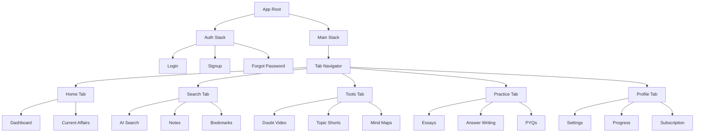
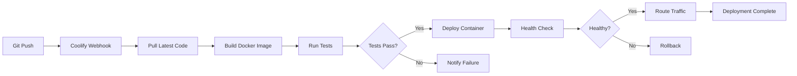
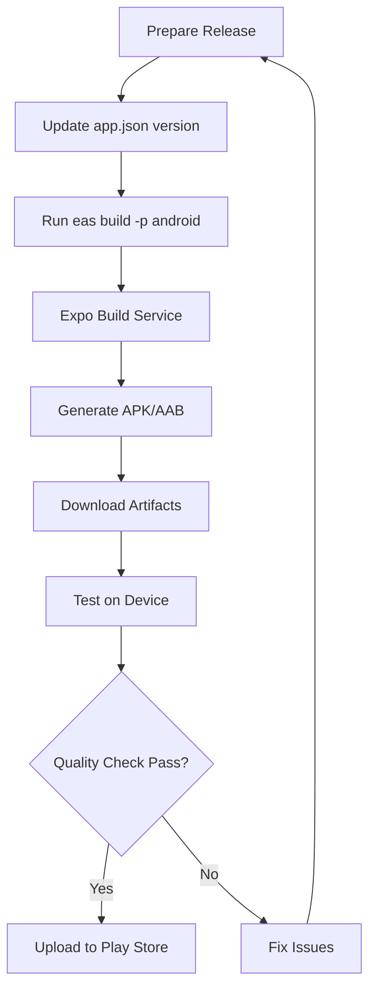
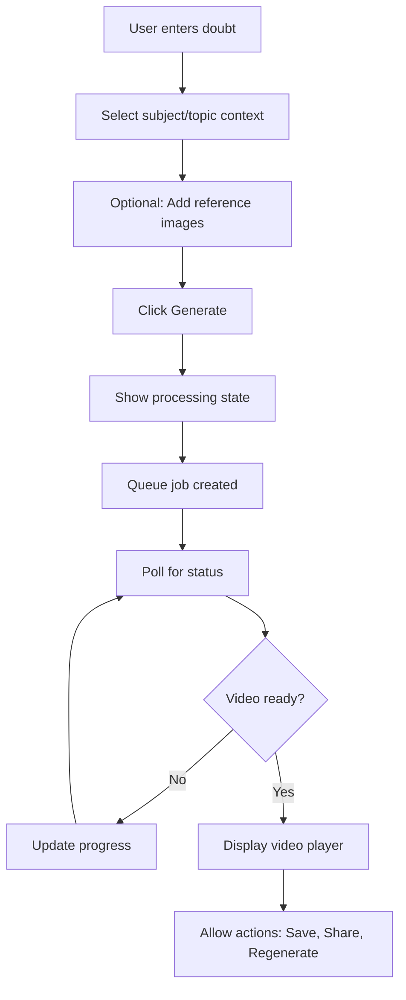

# Frontend UI Redesign & Mobile App Development

## Design Intent

This design defines the complete frontend transformation of the UPSC PrepX-AI platform, including web UI redesign and new mobile app development. The goal is to deliver a production-grade, enterprise-level user experience that matches the aesthetic and quality standards of Apple, Stripe, Linear, Notion, and modern AI SaaS products, while maintaining strict separation between user-facing and admin interfaces.

## Core Design Philosophy

### Visual Language

The interface must embody the following principles:

- **Apple-style Minimalism**: Clean, purposeful design with every element serving a clear function
- **Premium Futurism**: Sophisticated visual depth through glassmorphism and subtle neumorphism
- **Calm Enterprise Feel**: Professional, distraction-free environment conducive to focused learning
- **Dark-First Design**: Optimized for extended study sessions with elegant light mode alternative
- **Neon Accent System**: Strategic use of neon colors for AI-driven elements, focus states, and active indicators

### Design Constraints

The following are strictly prohibited:

- Cartoonish or playful UI elements
- Gamified visual clutter in layout structure
- Placeholder-looking stock imagery
- Hardcoded background images within components
- Mixing of admin controls within user interface

## Dynamic Theming Architecture

### AI-Driven Visual Refresh System

The application features a central AI orchestration system that automatically updates visual elements while maintaining layout stability.

#### Dynamic Elements

The system refreshes the following on a scheduled basis:

- Background imagery across all major sections
- Hero visuals on landing and dashboard pages
- Decorative section imagery
- Thematic overlays and ambient visuals

#### Stable Elements

The following remain constant regardless of theme updates:

- Layout structure and component hierarchy
- Navigation patterns and information architecture
- Spacing, rhythm, and typography system
- Interactive component behaviors
- Functional UI elements

### Implementation Strategy

**CSS Variable Architecture**

All dynamic visual elements must be referenced through CSS custom properties that can be updated without component re-rendering:

| Variable Purpose | CSS Variable Name | Usage Context |
|-----------------|------------------|---------------|
| Primary background | `--bg-dynamic-primary` | Main page backgrounds |
| Hero section | `--bg-dynamic-hero` | Landing and dashboard heroes |
| Section accent | `--bg-dynamic-section` | Feature section backgrounds |
| Ambient overlay | `--bg-dynamic-overlay` | Decorative depth layers |

**Background Update Mechanism**

The theme system operates through:

- Dedicated background layer components that listen to theme updates
- Separation of structural JSX from visual decoration
- Server-side theme data updates via scheduled jobs
- Client-side subscription to theme changes without page reload

## Application Structure

### User Panel (Learner Interface)

The user-facing application provides a focused, immersive learning environment.

#### Access Scope

Contains exclusively:

- Learning features and content
- Personal progress tracking
- Study tools and resources
- Subscription management
- Profile and preferences

Strictly excludes:

- Administrative controls
- System configuration
- Content moderation tools
- Analytics dashboards
- Operational toggles

#### Navigation Architecture



```mermaid
graph TD
    A[User Home] --> B[Dashboard]
    A --> C[Knowledge Search]
    A --> D[Syllabus Explorer]
    A --> E[Study Tools]
    A --> F[Practice & Tests]
    A --> G[Community]
    
    B --> B1[Daily Current Affairs]
    B --> B2[Recommended Content]
    B --> B3[Progress Overview]
    
    C --> C1[AI Search]
    C --> C2[Notes Library]
    C --> C3[Bookmarks]
    
    D --> D1[3D Syllabus Map]
    D --> D2[Topic Explorer]
    
    E --> E1[Doubt Video Generator]
    E --> E2[Topic Shorts]
    E --> E3[Memory Palace]
    E --> E4[Mind Maps]
    E --> E5[Math Solver]
    
    F --> F1[Essay Writing]
    F --> F2[Answer Writing]
    F --> F3[PYQ Database]
    F --> F4[Mock Interviews]
    F --> F5[Ethics Cases]
    
    G --> G1[Study Groups]
    G --> G2[Rankings]
    G --> G3[Toppers]
```

### Admin Panel (Operational Interface)

The administrative interface provides powerful system management capabilities in a separate, secure environment.

#### Routing Strategy

- Base route: `/admin`
- Completely isolated Next.js route group
- No shared navigation components with user panel
- Independent layout and styling context

#### Access Scope

Contains exclusively:

- System monitoring dashboards
- Content moderation tools
- User management
- Queue system monitoring
- AI provider configuration
- Advertisement management
- Analytics and reporting
- System health status

#### Security Posture

| Security Measure | Implementation |
|-----------------|----------------|
| Authentication | Required for all admin routes |
| Default credentials | Username: root, Password: VPS root password |
| First login policy | Force password reset |
| Recommended MFA | Two-factor authentication support |
| Session management | Separate session context from user panel |
| Audit logging | All administrative actions logged |
| Access control | Role-based permissions system |

#### Navigation Architecture



```mermaid
graph TD
    A[Admin Portal] --> B[Dashboard]
    A --> C[Knowledge Base]
    A --> D[Queue Monitor]
    A --> E[AI Providers]
    A --> F[Ads Management]
    A --> G[System Status]
    
    B --> B1[Overview Metrics]
    B --> B2[Active Users]
    B --> B3[System Alerts]
    
    C --> C1[Content Library]
    C --> C2[Syllabus Management]
    C --> C3[RAG Status]
    
    D --> D1[Job Queue Status]
    D --> D2[Worker Health]
    D --> D3[Failed Jobs]
    
    E --> E1[Provider Config]
    E --> E2[API Keys]
    E --> E3[Usage Metrics]
    
    F --> F1[Ad Campaigns]
    F --> F2[Placement Rules]
    F --> F3[Revenue Metrics]
    
    G --> G1[Service Health]
    G --> G2[Database Status]
    G --> G3[VPS Resources]
```

## UI Component System

### Technology Foundation

All UI components must be built using:

- **shadcn/ui**: Component library foundation
- **Tailwind CSS**: Styling system
- **Lucide React**: Icon system
- **Framer Motion**: Animation library
- **TypeScript**: Type safety
- **React Hook Form**: Form management
- **Zod**: Schema validation

### Visual Style System

#### Glassmorphism Implementation

Glass effect cards and panels using:

- Backdrop blur: 16px to 24px
- Background opacity: 0.05 to 0.15
- Border: 1px solid rgba(255, 255, 255, 0.1)
- Subtle glow on hover: 0 4px 20px rgba(neon-color, 0.2)

#### Neumorphism Implementation

Soft depth effect for containers and controls:

- Dual shadow system: inset and outset
- Light source: top-left direction
- Shadow colors: Dark shadow (black with 0.3 opacity), Light shadow (white with 0.02 opacity)
- Applied to: Cards, buttons, input fields, navigation elements

#### Neon Accent System

Strategic color usage for AI and interactive elements:

| Accent Color | Use Case | CSS Variable |
|--------------|----------|--------------|
| Neon Blue | Primary AI features, active navigation | `--neon-blue: #00f3ff` |
| Neon Purple | Premium features, AI processing | `--neon-purple: #bc13fe` |
| Neon Green | Success states, completed items | `--neon-green: #00ff9d` |
| Neon Pink | Notifications, attention items | `--neon-pink: #ff006b` |

#### Typography System

Hierarchy and scale:

| Level | Font Size | Weight | Line Height | Usage |
|-------|-----------|--------|-------------|-------|
| H1 | 3rem (48px) | 700 | 1.2 | Page titles |
| H2 | 2rem (32px) | 600 | 1.3 | Section headers |
| H3 | 1.5rem (24px) | 600 | 1.4 | Subsection headers |
| Body | 1rem (16px) | 400 | 1.6 | Primary content |
| Small | 0.875rem (14px) | 400 | 1.5 | Secondary text |
| Tiny | 0.75rem (12px) | 500 | 1.4 | Labels, metadata |

#### Spacing System

Consistent rhythm using 8px base unit:

- Micro: 4px (0.25rem)
- Small: 8px (0.5rem)
- Medium: 16px (1rem)
- Large: 24px (1.5rem)
- XLarge: 32px (2rem)
- XXLarge: 48px (3rem)
- Mega: 64px (4rem)

### Animation Principles

All animations must be:

- Subtle and purposeful
- Performance-optimized (GPU-accelerated)
- Accessible (respect prefers-reduced-motion)
- Implemented via Framer Motion

Common animation patterns:

| Pattern | Duration | Easing | Usage |
|---------|----------|--------|-------|
| Fade in | 200ms | ease-out | Element appearance |
| Slide in | 300ms | ease-out | Panel reveals |
| Scale | 150ms | spring | Button press feedback |
| Glow | 400ms | ease-in-out | AI processing indicator |
| Shimmer | 2s loop | linear | Loading states |

## Page-Level Design Specifications

### Landing Page (Marketing)

Visual composition matching uploaded reference image aesthetics:

**Hero Section**

- Full-viewport height with dynamic background
- Glassmorphic centered card containing:
  - Main headline (H1)
  - Supporting description
  - Dual CTA buttons (primary + secondary)
- Subtle particle animation in background
- Gradient overlay for text readability

**Feature Showcase**

- Three-column grid on desktop
- Neumorphic feature cards with:
  - Icon with neon accent glow
  - Feature name
  - Brief description
  - "Learn more" interaction
- Staggered fade-in animation on scroll

**Pricing Section**

- Four-column plan comparison table
- "Most Popular" badge on annual plan
- Glassmorphic plan cards
- Feature comparison with check marks
- CTA buttons per plan

### Dashboard (User Home)

**Layout Structure**

- Left sidebar navigation (fixed)
- Main content area (scrollable)
- Right sidebar for quick actions (optional, collapsible)

**Content Sections**

| Section | Purpose | Visual Treatment |
|---------|---------|------------------|
| Daily Current Affairs | Today's video content | Large featured card with thumbnail |
| Progress Overview | Study statistics | Grid of metric cards with charts |
| Recommended Content | AI suggestions | Horizontal scroll carousel |
| Recent Activity | User timeline | Vertical list with timestamps |
| Upcoming Reviews | Spaced repetition | Card stack with due dates |

### Knowledge Search

**Interface Layout**

- Prominent search bar at top center
- Filter sidebar (collapsible)
- Results grid with infinite scroll
- Real-time search suggestions

**Search Bar Design**

- Glassmorphic container
- Large input field with subtle neon border on focus
- AI icon indicator
- Voice search option
- Recent searches dropdown

**Result Cards**

Each result displays:

- Content type icon
- Title and excerpt
- Relevance score (subtle indicator)
- Bookmark action
- Quick preview on hover

### 3D Syllabus Explorer

**Canvas Integration**

- Full-screen 3D canvas powered by React Three Fiber
- Overlay UI controls (non-intrusive)
- Minimap in corner
- Legend panel (toggleable)

**Interactive Elements**

- Node selection highlights with neon glow
- Connection lines with animated flow
- Zoom and pan controls
- Reset view button
- Bookmark nodes directly from 3D view

**Information Panel**

- Slides in from right on node selection
- Displays:
  - Topic details
  - Progress percentage
  - Confidence level
  - Available actions (generate video, create notes, etc.)

### Study Tools Pages

Each tool (Doubt Video, Topic Shorts, Memory Palace, Mind Maps, Math Solver) follows this pattern:

**Page Structure**

- Tool-specific header with description
- Input section (glassmorphic card)
- Action button (prominent, neon-accented)
- Results/output area
- History sidebar

**Input Design**

Form fields using:

- Neumorphic text inputs
- Dropdown selects with smooth animations
- File upload with drag-and-drop
- Character/token counters
- Validation feedback

**Processing States**

Visual feedback during AI generation:

- Shimmer loading effect
- Progress indicator
- Status messages
- Cancel option
- Estimated time remaining

### Community Features

**Study Groups Interface**

Matching the uploaded Social Learning Engine reference:

- Green-themed header with notification bell
- Tab navigation (Study Groups, Rankings, Collaborate, Toppers)
- Search bar for group discovery
- Filter pills (My Groups, Suggested, Create)
- Group cards displaying:
  - Group name and match percentage
  - Subject and location
  - Description
  - Member count and activity level
  - Topic tags
  - Last active timestamp
  - Action buttons (View Group, Message)

**Visual Design**

- Cards with subtle shadow depth
- Green accent color for CTAs
- Activity indicators (High/Medium/Low with colored dots)
- Match percentage badges (green background)
- Rounded corners (12px radius)
- Clean typography hierarchy

### Practice & Assessment Pages

**Essay Writing Interface**

- Split-screen layout:
  - Left: Essay editor (rich text)
  - Right: AI feedback panel (updates in real-time)
- Word count and timer display
- Reference material drawer (collapsible)
- Submit for detailed analysis

**Mock Interview Studio**

- Video interface for real-time AI interview
- Questions displayed on-screen
- Timer per question
- Recording controls
- Transcript view (toggleable)
- Post-interview analysis dashboard

**PYQ Explorer**

- Filter by year, subject, paper type
- Question cards with:
  - Difficulty badge
  - Topic tags
  - Marks allocation
  - Video explanation availability
- Detail view with model answer and video player

## Mobile App Design (React Native + Expo)

### Platform Strategy

**Technology Stack**

- React Native with Expo framework
- NativeWind (Tailwind CSS for React Native)
- React Navigation for routing
- Expo modules for native capabilities
- Supabase SDK for backend connectivity

**Reference Implementation**

Follow patterns from: `https://github.com/MrNitro360/React-Native-MCP.git`

### App Architecture

**Navigation Structure**



### Mobile-Specific UI Patterns

**Bottom Tab Bar**

- Fixed bottom navigation
- Five primary tabs
- Active state with neon accent glow
- Icon + label (label hidden on scroll)
- Smooth transitions

**Gesture Interactions**

| Gesture | Action | Feedback |
|---------|--------|----------|
| Swipe right | Go back | Screen slide animation |
| Swipe down | Refresh content | Pull-to-refresh indicator |
| Long press | Quick actions menu | Haptic feedback + menu |
| Pinch | Zoom (where applicable) | Smooth scale |
| Double tap | Bookmark/favorite | Heart animation |

**Card-Based Layouts**

Mobile screens use card-based information hierarchy:

- Full-width cards with internal padding
- Swipeable card stacks for content browsing
- Collapsible card sections
- Card actions revealed on swipe

**Video Player Adaptation**

- Portrait mode by default
- Full-screen landscape on rotation
- Picture-in-picture support
- Download for offline viewing
- Quality auto-selection based on network

### Mobile Performance Optimizations

**Asset Management**

- Lazy load images below the fold
- Use optimized image formats (WebP)
- Implement image caching
- Progressive image loading

**Code Splitting**

- Route-based code splitting
- Lazy load heavy features (3D, video editors)
- On-demand module loading
- Tree shaking for unused code

**Offline Capability**

- Cache critical content
- Queue operations when offline
- Sync when connection restored
- Offline indicator in UI

## Deployment Architecture

### Web Application Deployment

**Target Infrastructure**

- VPS IP: 89.117.60.144
- Platform: Coolify (self-hosted PaaS)
- Container: Docker multi-stage build
- SSL: Let's Encrypt (automatic)

**Docker Build Strategy**

Multi-stage Dockerfile for Next.js application:

**Stage 1: Dependencies**

- Install production and development dependencies
- Utilize layer caching for faster rebuilds

**Stage 2: Build**

- Copy application source
- Run Next.js build process
- Generate static and dynamic pages
- Optimize assets

**Stage 3: Production**

- Copy only production dependencies
- Copy build artifacts
- Set environment variables
- Expose port
- Define health check endpoint
- Set non-root user for security

**Environment Variables**

Must be configured in Coolify:

| Variable Category | Examples | Security Level |
|------------------|----------|----------------|
| Supabase | NEXT_PUBLIC_SUPABASE_URL, SUPABASE_SERVICE_ROLE_KEY | Secret |
| AI Providers | A4F_API_KEY, ANTHROPIC_API_KEY | Secret |
| App Config | NEXT_PUBLIC_APP_URL | Public |
| Feature Flags | ENABLE_PREMIUM_FEATURES | Public |
| CDN | CDN_BASE_URL, CLOUDFLARE_ZONE_ID | Secret |

**Deployment Process**



**Public URLs**

After deployment:

- User App: `https://app.upscprepx.ai` (or Coolify-assigned domain)
- Admin Panel: `https://app.upscprepx.ai/admin`

### Mobile App Deployment

**Android Build Process**

Using Expo EAS Build:

**Build Configuration**

- Configure `eas.json` with build profiles:
  - Development: Debug build for testing
  - Preview: Release build for internal testing
  - Production: Signed APK/AAB for Play Store

**Build Command Flow**



**Distribution Channels**

- **Internal Testing**: Direct APK distribution
- **Beta**: Google Play Internal Testing track
- **Production**: Google Play Store release

**iOS Build Process** (Future)

When Mac build server or EAS cloud builds are available:

- Configure iOS signing credentials
- Build via EAS for iOS
- Submit to TestFlight
- Release to App Store

## Security & Compliance Standards

### Frontend Security Measures

**Environment Variable Management**

- Never commit secrets to repository
- Use Coolify environment variable system
- Access secrets server-side only
- Public variables prefixed with NEXT_PUBLIC_

**HTTP Security**

| Header | Value | Purpose |
|--------|-------|---------|
| Strict-Transport-Security | max-age=31536000; includeSubDomains | Force HTTPS |
| Content-Security-Policy | Defined per route | Prevent XSS |
| X-Frame-Options | DENY | Prevent clickjacking |
| X-Content-Type-Options | nosniff | Prevent MIME sniffing |
| Referrer-Policy | strict-origin-when-cross-origin | Control referrer info |

**Session Management**

- HttpOnly cookies for auth tokens
- Secure flag enabled (HTTPS only)
- SameSite=Strict to prevent CSRF
- Session timeout after inactivity
- Refresh token rotation

**Rate Limiting**

Apply rate limits on:

- Login attempts: 5 per 15 minutes
- Signup: 3 per hour per IP
- Password reset: 3 per hour
- AI generation endpoints: Per user tier limits

### Admin Panel Security

**Access Control**

- Dedicated authentication flow
- Separate session context from user panel
- IP whitelist option (configurable)
- Admin action audit logging

**Credential Management**

- Default username: root
- Default password: VPS root password
- Force password change on first login
- Minimum password strength requirements
- Optional MFA (TOTP-based)

**Audit Trail**

All admin actions logged with:

- Timestamp
- Admin user ID
- Action type
- Resource affected
- IP address
- User agent

### Accessibility Standards

**WCAG 2.1 Level AA Compliance**

**Color Contrast**

- Normal text: Minimum 4.5:1 ratio
- Large text: Minimum 3:1 ratio
- Interactive elements: Minimum 3:1 ratio
- Neon accents validated for contrast

**Keyboard Navigation**

- All interactive elements reachable via Tab
- Logical tab order
- Visible focus indicators (neon glow)
- Skip navigation links
- Keyboard shortcuts for power users

**Screen Reader Support**

- Semantic HTML elements
- ARIA labels for custom components
- ARIA live regions for dynamic updates
- Alt text for all meaningful images
- Hidden decorative elements from screen readers

**Responsive Design**

- Mobile-first approach
- Breakpoints:
  - Mobile: 320px - 640px
  - Tablet: 641px - 1024px
  - Desktop: 1025px+
  - Large desktop: 1440px+

## Feature-Specific Design Details

### AI Doubt Video Generator

**User Flow**



**UI Components**

- Doubt input: Rich text editor with 500 character limit
- Context selectors: Dropdown menus
- Image upload: Drag-and-drop zone (max 3 images, 5MB each)
- Generate button: Large, neon-accented, disabled when insufficient input
- Progress display: Animated progress bar with stage labels
- Video player: Custom player with chapter markers

### Daily Current Affairs

**Content Display**

- Hero video player at top
- Today's summary (AI-generated)
- Related news articles (expandable cards)
- Quiz questions based on content
- Bookmark entire session

**Notification Strategy**

- Push notification at user-configured time
- Email digest option
- In-app badge on new content
- Streak tracking for daily engagement

### Memory Palace Creator

**Generation Interface**

- Topic input field
- Facts list builder (add/remove facts)
- Palace theme selector (library, courtroom, temple, etc.)
- Visual style options
- Generate 3D walkthrough

**Viewer Experience**

- 3D scene navigation (WebXR for VR, fallback to 360° video)
- Fact stations marked with glowing markers
- Audio narration (auto-play option)
- Spatial audio positioning
- Progress tracking through palace
- Export as video option

### Mock Interview Studio

**Real-Time Interview Interface**

- Webcam feed (user sees themselves)
- AI interviewer avatar or voice-only mode
- Current question displayed prominently
- Timer for response
- Microphone level indicator
- Pause/resume controls

**Post-Interview Analysis**

- Recording playback
- Transcript with timestamps
- AI evaluation:
  - Content quality score
  - Communication clarity
  - Body language analysis (if video enabled)
  - Suggested improvements
- Comparison with topper responses
- Save session for review

### Essay Writing Tool

**Writing Environment**

- Distraction-free editor
- Word count (live)
- Timer (optional)
- Reference material panel (resizable)
- Auto-save every 30 seconds

**AI Feedback Loop**

Real-time sidebar feedback on:

- Structure and coherence
- Argument strength
- Use of examples
- Language quality
- UPSC evaluation parameters

**Submission Analysis**

After submission:

- Comprehensive score breakdown
- Paragraph-level feedback
- Suggested edits
- Model answer comparison
- Improvement trajectory graph

## Design Handoff Specifications

### Design Tokens

All design values exported as design tokens for developer implementation:

**Color Tokens**

JSON structure:

```
{
  "colors": {
    "background": {
      "primary": "hsl(222, 84%, 4.9%)",
      "secondary": "hsl(217, 32.6%, 17.5%)"
    },
    "neon": {
      "blue": "#00f3ff",
      "purple": "#bc13fe",
      "green": "#00ff9d",
      "pink": "#ff006b"
    },
    "text": {
      "primary": "hsl(210, 40%, 98%)",
      "secondary": "hsl(215, 16%, 47%)"
    }
  }
}
```

**Spacing Tokens**

```
{
  "spacing": {
    "micro": "0.25rem",
    "small": "0.5rem",
    "medium": "1rem",
    "large": "1.5rem",
    "xlarge": "2rem",
    "xxlarge": "3rem",
    "mega": "4rem"
  }
}
```

**Typography Tokens**

```
{
  "typography": {
    "fontFamily": {
      "primary": "Inter, sans-serif"
    },
    "fontSize": {
      "h1": "3rem",
      "h2": "2rem",
      "h3": "1.5rem",
      "body": "1rem",
      "small": "0.875rem",
      "tiny": "0.75rem"
    },
    "fontWeight": {
      "regular": 400,
      "medium": 500,
      "semibold": 600,
      "bold": 700
    }
  }
}
```

### Component Library Structure

Organized by atomic design principles:

**Atoms**

- Button (variants: primary, secondary, ghost, danger)
- Input (text, number, email, password)
- Label
- Badge
- Icon
- Avatar
- Checkbox
- Radio
- Switch
- Slider

**Molecules**

- Form Field (label + input + validation message)
- Search Bar (input + icon + suggestions)
- Card (container with header, body, footer)
- Dropdown Menu
- Tooltip
- Progress Bar
- Breadcrumb
- Pagination

**Organisms**

- Navigation Bar
- Sidebar
- Dashboard Card
- Video Player
- Form (complete with validation)
- Data Table
- Modal Dialog
- Notification Toast

**Templates**

- Dashboard Layout
- Content Page Layout
- Auth Page Layout
- Admin Layout
- Landing Page Sections

### Responsive Behavior

Breakpoint-specific layout changes:

**Mobile (320px - 640px)**

- Single column layouts
- Hamburger navigation menu
- Stacked cards
- Bottom tab bar for primary navigation
- Simplified data tables (vertical cards)
- Hidden secondary information (accessible via tap)

**Tablet (641px - 1024px)**

- Two-column layouts where appropriate
- Sidebar navigation (collapsible)
- Grid cards (2 columns)
- Overlay navigation on smaller tablets
- Split-screen for certain features (essay editor)

**Desktop (1025px+)**

- Multi-column layouts
- Persistent sidebar navigation
- Grid cards (3-4 columns)
- Hover states and tooltips
- Keyboard shortcuts enabled
- Dense information displays

**Large Desktop (1440px+)**

- Maximum content width constraint (1400px)
- Additional sidebar for metadata/actions
- Grid cards (4+ columns)
- Picture-in-picture for videos
- Advanced data visualizations

## Performance Budgets

### Web Application

**Load Time Targets**

| Metric | Target | Measurement |
|--------|--------|-------------|
| First Contentful Paint | < 1.8s | Lighthouse |
| Largest Contentful Paint | < 2.5s | Lighthouse |
| Time to Interactive | < 3.8s | Lighthouse |
| Cumulative Layout Shift | < 0.1 | Lighthouse |
| First Input Delay | < 100ms | Real User Monitoring |

**Asset Budgets**

| Asset Type | Budget | Notes |
|------------|--------|-------|
| JavaScript | < 350KB | Gzipped, initial bundle |
| CSS | < 50KB | Gzipped, critical CSS |
| Fonts | < 100KB | WOFF2 format |
| Images (per page) | < 500KB | Optimized, lazy loaded |

**Bundle Size Strategy**

- Route-based code splitting
- Dynamic imports for heavy features
- Tree shaking unused code
- Minimize third-party dependencies

### Mobile Application

**Startup Performance**

- App launch to interactive: < 2s
- Screen transition: < 300ms
- Network request to UI update: < 500ms

**Memory Usage**

- Idle state: < 100MB
- Active usage: < 200MB
- Peak (heavy features): < 350MB

**Battery Optimization**

- Minimize background processing
- Efficient location tracking
- Optimized network requests (batching)
- Reduce wake locks

## Monitoring & Analytics

### User Experience Monitoring

**Metrics to Track**

- Page load performance (per route)
- Feature usage frequency
- Error rates and types
- User flows and drop-off points
- Session duration and engagement

**Tools Integration**

- Google Analytics 4 for behavioral analytics
- Sentry for error tracking
- Vercel Analytics (or equivalent) for performance
- Supabase Analytics for database queries

### Admin Dashboard Analytics

**System Health Metrics**

- Active user count (real-time)
- API response times
- Queue job processing rates
- Error rates by endpoint
- Database query performance
- VPS resource utilization (CPU, memory, disk)

**Business Metrics**

- Daily active users
- Subscription conversion rate
- Feature adoption rates
- Revenue metrics (subscriptions)
- User retention cohorts
- Content generation volume

## Internationalization (Future Enhancement)

### Language Support Preparation

**Current State**

- English (primary)
- Hindi (existing implementation in LanguageContext)

**UI Architecture for i18n**

- All user-facing strings extracted to translation files
- Component text passed through translation function
- Right-to-left (RTL) layout preparation
- Date/time formatting per locale
- Number formatting per locale

**Translation Strategy**

- JSON translation files per language
- Organized by feature/route
- Fallback to English for missing translations
- Dynamic language switching without reload
- User language preference stored in profile

## Testing Strategy

### Web Application Testing

**Unit Tests**

- Component rendering tests (React Testing Library)
- Utility function tests (Jest)
- Hook behavior tests
- Form validation logic tests

**Integration Tests**

- User flow tests (key journeys)
- API integration tests
- State management tests
- Authentication flow tests

**End-to-End Tests**

- Critical user journeys (Playwright):
  - Signup → Login → Dashboard → Feature usage
  - Content generation flows
  - Subscription purchase
  - Admin panel operations
- Cross-browser testing (Chrome, Firefox, Safari)
- Responsive design validation

**Visual Regression Tests**

- Chromatic or Percy for visual diffs
- Component library snapshots
- Page layout screenshots

### Mobile Application Testing

**Manual Testing**

- Physical device testing (various Android versions)
- Gesture interaction validation
- Offline functionality testing
- Push notification testing
- Deep linking validation

**Automated Testing**

- Component unit tests (Jest)
- Navigation flow tests (React Navigation testing)
- Detox for E2E tests
- Expo automated testing tools

### Accessibility Testing

- Axe DevTools for automated checks
- Manual keyboard navigation testing
- Screen reader testing (NVDA, JAWS, VoiceOver)
- Color contrast validation
- Focus management verification

## Deployment Verification Checklist

Upon completion of deployment, verify:

**Web Application**

- [ ] User app accessible via public URL
- [ ] Admin panel accessible at /admin route
- [ ] HTTPS certificate valid (green padlock)
- [ ] Environment variables loaded correctly (check functionality, not values)
- [ ] Database connection successful (user signup/login works)
- [ ] AI features functional (generate content test)
- [ ] Static assets served correctly (images, fonts)
- [ ] No console errors on primary pages
- [ ] Responsive design works (mobile, tablet, desktop)
- [ ] Admin login works with provided credentials
- [ ] Admin features isolated (not visible in user panel)

**Mobile Application**

- [ ] APK installs successfully on test device
- [ ] App launches without crashes
- [ ] Backend connectivity established
- [ ] User authentication works
- [ ] Primary features functional
- [ ] Offline mode works (where applicable)
- [ ] Push notifications received
- [ ] App handles network errors gracefully
- [ ] No performance issues (smooth scrolling, animations)

**Security Verification**

- [ ] No secrets visible in client-side code
- [ ] HTTPS enforced on all routes
- [ ] Admin panel requires authentication
- [ ] Session management working (logout, timeout)
- [ ] Rate limiting active on sensitive endpoints
- [ ] CORS configured correctly
- [ ] Security headers present in responses

## Confidence Assessment

**Confidence Level**: High

**Basis for Confidence**:

1. **Clear Requirements**: Detailed prompt with specific design direction, visual references, and technical constraints
2. **Existing Infrastructure**: Backend, database, and deployment infrastructure already in place
3. **Proven Technologies**: Using established, production-ready frameworks (Next.js, React Native, shadcn/ui)
4. **Reference Implementation**: GitHub reference provided for mobile app patterns
5. **Defined Scope**: Strictly UI/UX and deployment work, no backend logic changes

**Key Success Factors**:

- Adherence to visual design system (glassmorphism, neumorphism, neon accents)
- Strict separation of user and admin interfaces
- Successful Coolify deployment with HTTPS
- Mobile app following MCP reference patterns
- All security requirements met (no secrets exposed, admin credentials managed properly)

**Potential Challenges**:

- Ensuring dynamic theme system doesn't impact performance
- 3D syllabus visualization may need performance optimization on lower-end devices
- Mobile app size management to keep under Play Store recommendations
- Ensuring consistency between web and mobile experiences while respecting platform patterns

---

**Design Document Version**: 1.0  
**Last Updated**: 2025-12-31  
**Review Status**: Ready for Implementation
