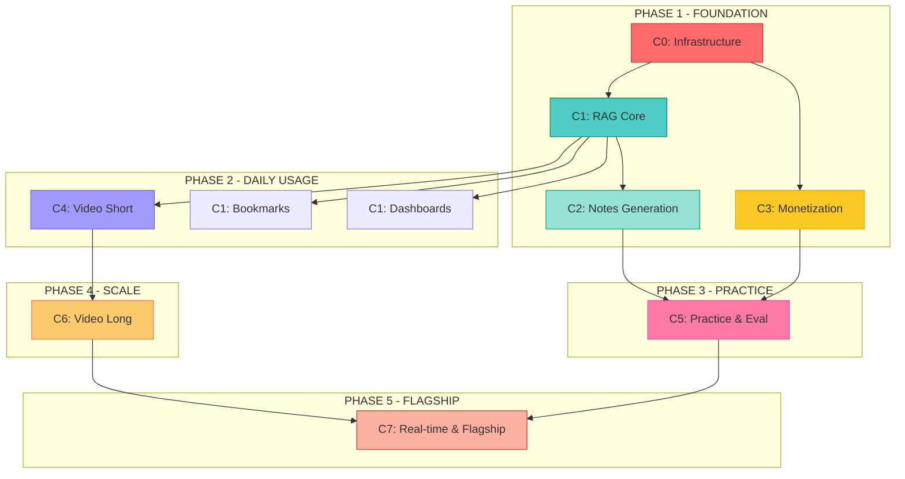

# UPSC AI Mentor - Cluster-Based Build Roadmap

**Created:** December 23, 2025
**Scrum Master:** Bob
**Principle:** Strict Sequencing Over Speed - Stability Over Velocity

---

## Build Philosophy

**NON-NEGOTIABLE RULES:**

1. **Clusters must reach stability** before next cluster begins
2. **Features built in dependency order**, not excitement order
3. **Killer features built LAST**, not first
4. **No skipping phases** - each phase has measurable gates
5. **Slow, controlled build** beats fast, chaotic one

---

## Cluster Definitions

### Required Clusters (7 Total)

| Cluster ID | Cluster Name | Primary Goal | Epics Involved |
|------------|--------------|--------------|----------------|
| **C0** | Infrastructure Foundation | VPS validation, dev environment, CI/CD | Epic 0 |
| **C1** | Knowledge & RAG Core | Search, vector DB, knowledge base | Epic 1 (Stories 1.1-1.8) |
| **C2** | Notes & Content Generation | Multi-level notes, book-to-notes | Epic 2 (Stories 2.1-2.4) |
| **C3** | Monetization Infrastructure | Trials, subscriptions, entitlements | Epic 5 (Stories 5.1-5.5) |
| **C4** | Video Generation (Short) | 60s topic shorts, basic rendering | Epic 4 (partial) |
| **C5** | Practice & Evaluation | Answer writing, tests, MCQs | Epic 7, Epic 8 |
| **C6** | Video Generation (Long) | Daily CA, documentary lectures | Epic 3, Epic 10 |
| **C7** | Flagship & Real-time | Interview prep studio, immersive | Epic 13, Epic 15 |

---

## Phase-by-Phase Build Order

### **PHASE 1: FOUNDATION (Weeks 1-4)**

**Objective:** Establish core infrastructure enabling basic AI-powered learning

**Clusters:**
- ✅ **C0: Infrastructure Foundation** (Week 1, Days 1-5)
- ✅ **C1: Knowledge & RAG Core** (Week 1-2, Days 6-14)
- ✅ **C2: Notes & Content Generation** (Week 2-3, Days 15-21)
- ✅ **C3: Monetization Infrastructure** (Week 3-4, Days 22-28)

**Epics:**
- Epic 0: Infrastructure Prerequisites (14 stories)
- Epic 1: Foundation & RAG (Stories 1.1-1.8 only - 8 stories)
- Epic 2: Core Learning (Stories 2.1-2.4 only - 4 stories)
- Epic 5: Monetization (Stories 5.1-5.5 only - 5 stories)

**Total Stories:** 31 stories
**Total ACs:** ~310 acceptance criteria

**Phase Gate (Must Pass to Proceed):**
- [ ] Users can signup and get 7-day trial automatically
- [ ] RAG search returns results in <500ms with citations
- [ ] Notes generation works for any syllabus topic
- [ ] Entitlement checks block free users from premium features
- [ ] No critical infrastructure blockers identified
- [ ] PO validates: "Core value proposition demonstrable"

**Deliverable:** MVP Foundation - Users can search, read notes, see trial countdown

---

### **PHASE 2: DAILY USAGE (Weeks 5-8)**

**Objective:** Add daily-use features that drive engagement and habit formation

**Clusters:**
- ✅ **C4: Video Generation (Short)** (Week 5-6, Days 29-42)
- ✅ **C1 Extended: Smart Bookmarks** (Week 7, Days 43-49)
- ✅ **C1 Extended: Basic Dashboards** (Week 8, Days 50-56)

**Epics:**
- Epic 4: Doubt Converter (Stories 4.4-4.5 only - Topic Shorts, 2 stories)
- Epic 1: Foundation (Stories 1.9-1.10 - Trial logic, Health dashboard, 2 stories)
- Epic 6: Progress Tracking (Stories 6.1-6.3 - Bookmarks, Schedule, Confidence, 3 stories)

**Total Stories:** 7 stories
**Total ACs:** ~70 acceptance criteria

**Phase Gate:**
- [ ] 60-second topic videos render successfully in <60s
- [ ] Users can bookmark topics and schedule revisions
- [ ] Dashboard shows progress and weak areas
- [ ] Video generation costs measured (<₹50/video target)
- [ ] Bookmark sync working across devices
- [ ] PO validates: "Users return daily for topic shorts"

**Deliverable:** Daily Habit Loop - Short videos + bookmarks + progress tracking

---

### **PHASE 3: PRACTICE & FEEDBACK (Weeks 9-12)**

**Objective:** Enable deliberate practice with AI-powered evaluation

**Clusters:**
- ✅ **C5: Practice & Evaluation** (Week 9-12, Days 57-84)

**Epics:**
- Epic 7: Answer Writing & Essays (Stories 7.1-7.4 - 4 stories)
- Epic 8: PYQs & Question Bank (Stories 8.1-8.3 - 3 stories)
- Epic 2: Core Learning (Stories 2.5-2.7 - Syllabus navigator - 3 stories)

**Total Stories:** 10 stories
**Total ACs:** ~100 acceptance criteria

**Phase Gate:**
- [ ] Answer writing submissions receive AI scores within 30s
- [ ] Essay trainer provides video feedback with rubric breakdown
- [ ] Test series auto-grades both MCQs and descriptive answers
- [ ] PYQ video explanations generated for sample questions
- [ ] Users complete at least 3 answer submissions during beta test
- [ ] PO validates: "Practice loop drives skill improvement"

**Deliverable:** Practice Engine - Users write answers, get scored, improve

---

### **PHASE 4: SCALE & POLISH (Weeks 13-16)**

**Objective:** Add high-value features that scale learning and polish experience

**Clusters:**
- ✅ **C6: Video Generation (Long)** (Week 13-15, Days 85-105)
- ✅ **C1 Extended: Advanced Search** (Week 16, Days 106-112)

**Epics:**
- Epic 3: Daily Current Affairs Video (Stories 3.1-3.5 - 5 stories)
- Epic 10: Documentary Lectures (Stories 10.1-10.2 - 2 stories)
- Epic 9: Advanced Learning Tools (Stories 9.1-9.3 - Mindmaps, Assistants - 3 stories)

**Total Stories:** 10 stories
**Total ACs:** ~100 acceptance criteria

**Phase Gate:**
- [ ] Daily CA video publishes automatically at 6:00 AM IST (≤5% failure rate)
- [ ] 3-hour documentary lectures render successfully
- [ ] Weekly documentary analysis delivered on schedule
- [ ] Mindmap builder generates visual maps from notes
- [ ] Cost controls validated (<₹200/user/month)
- [ ] PO validates: "Platform feels comprehensive and premium"

**Deliverable:** Scale Platform - Automated daily content + long-form learning

---

### **PHASE 5: FLAGSHIP & IMMERSIVE (Post-MVP, Weeks 17-24)**

**Objective:** Add differentiated premium features that justify high pricing

**Clusters:**
- ✅ **C7: Flagship & Real-time Systems** (Week 17-24, Days 113-168)

**Epics:**
- Epic 13: Interview Prep Studio (Stories 13.1-13.5 - 5 stories)
- Epic 12: Ethics & Interview Prep (Stories 12.1-12.4 - 4 stories)
- Epic 15: Premium Media & Immersive (Stories 15.1-15.3 - 3 stories)
- Epic 14: Gamification (Stories 14.1-14.3 - 3 stories)

**Total Stories:** 15 stories
**Total ACs:** ~150 acceptance criteria

**Phase Gate:**
- [ ] Real-time AI interview works with <500ms latency
- [ ] Manim visual aids generate during interview (2-6s)
- [ ] Body language analysis (opt-in) provides feedback
- [ ] 360° immersive videos render successfully
- [ ] Gamification XP system drives engagement without distraction
- [ ] PO validates: "Flagship features justify premium pricing"

**Deliverable:** Flagship Platform - Interview studio, immersive experiences, gamification

---

## Dependency Map (Critical Path)

**Critical Dependencies:**
- **C0 blocks everything** - Infrastructure must be stable first
- **C1 enables C2, C4, C1B, C1C** - RAG is foundation for content features
- **C3 independent** - Monetization can build parallel to RAG (but needs C0)
- **C4 prerequisite for C6** - Short videos before long videos (complexity progression)
- **C5 needs C2 + C3** - Practice requires notes (content) + subscriptions (access control)
- **C7 needs C6** - Flagship requires proven video pipeline maturity

---

## Build Order Rationale

### Why Foundation First (Phase 1)?

**C0 (Infrastructure):**
- Without VPS validation, every feature is blocked
- Local dev environment required for any coding
- CI/CD needed for quality control from Day 1

**C1 (RAG Core):**
- Search is the "hello world" of AI platforms
- Establishes pattern: RAG → LLM → Response (used in all features)
- Validates core accuracy requirement (99% target)

**C2 (Notes):**
- Simple feature (no video complexity)
- Proves RAG + LLM integration end-to-end
- Delivers immediate user value (study materials)

**C3 (Monetization):**
- Trial logic needed BEFORE launching to users
- Entitlement checks required for all premium features
- Payment infrastructure takes time (RevenueCat integration, testing)

### Why Video Short Before Video Long (Phase 2 → Phase 4)?

**60s Topic Shorts (C4) before Daily CA (C6):**
- Shorter = simpler (fewer failure modes)
- Faster feedback loop (60s render vs 5-8 min render)
- Lower cost risk (less compute if something goes wrong)
- Proves Manim + Revideo pipeline before scaling

**Daily CA Requires:**
- Proven video rendering (from C4)
- Scheduled job stability (pg_cron maturity)
- Cost controls validated (can't afford failures on daily job)

### Why Flagship Last (Phase 5)?

**Interview Prep Studio (C7):**
- Real-time requirements (2-6s Manim latency)
- Most complex orchestration (TTS + Manim + recording + debrief)
- Requires mature video pipeline (proven in C6)
- High cost (real-time = expensive, need cost data from earlier phases)

---

## Sprint Planning by Phase

### Phase 1 Sprints (4 Sprints Total)

| Sprint | Cluster | Duration | Stories | Deliverable |
|--------|---------|----------|---------|-------------|
| **Sprint 1** | C0: Infrastructure | 5 days | 14 (Epic 0) | All services validated |
| **Sprint 2** | C1: RAG Core (Part 1) | 10 days | 8 (Epic 1.1-1.8) | Auth + DB + RAG search working |
| **Sprint 3** | C2: Notes Generation | 10 days | 4 (Epic 2.1-2.4) | Notes generator live |
| **Sprint 4** | C3: Monetization | 10 days | 5 (Epic 5.1-5.5) | Trial + subscription + entitlements |

**Phase 1 Total:** 35 days (~7 weeks with buffer)

### Phase 2 Sprints (2 Sprints Total)

| Sprint | Cluster | Duration | Stories | Deliverable |
|--------|---------|----------|---------|-------------|
| **Sprint 5** | C4: Video Short | 14 days | 2 (Epic 4 partial) | 60s topic videos working |
| **Sprint 6** | C1 Extended: Engagement | 14 days | 5 (Epic 1.9-1.10, Epic 6 partial) | Bookmarks + dashboards |

**Phase 2 Total:** 28 days (~4 weeks)

### Phase 3 Sprints (2 Sprints Total)

| Sprint | Cluster | Duration | Stories | Deliverable |
|--------|---------|----------|---------|-------------|
| **Sprint 7** | C5: Practice (Part 1) | 14 days | 4 (Epic 7 partial) | Answer writing + AI scoring |
| **Sprint 8** | C5: Practice (Part 2) | 14 days | 6 (Epic 7 + Epic 8 partial) | Essay trainer + PYQ engine |

**Phase 3 Total:** 28 days (~4 weeks)

### Phase 4 Sprints (2 Sprints Total)

| Sprint | Cluster | Duration | Stories | Deliverable |
|--------|---------|----------|---------|-------------|
| **Sprint 9** | C6: Daily CA Video | 14 days | 5 (Epic 3 partial) | Automated daily video at 6 AM |
| **Sprint 10** | C6: Documentary | 14 days | 5 (Epic 10 partial) | 3-hour lectures + weekly analysis |

**Phase 4 Total:** 28 days (~4 weeks)

### Phase 5 Sprints (3 Sprints - Post-MVP)

| Sprint | Cluster | Duration | Stories | Deliverable |
|--------|---------|----------|---------|-------------|
| **Sprint 11** | C7: Interview Studio | 14 days | 5 (Epic 13) | Real-time AI interview working |
| **Sprint 12** | C7: Immersive & Ethics | 14 days | 7 (Epic 12, Epic 15) | 360° videos, ethics simulator |
| **Sprint 13** | C7: Gamification | 14 days | 3 (Epic 14) | XP system, badges, predictions |

**Phase 5 Total:** 42 days (~6 weeks)

---

## Cluster-by-Cluster Breakdown

### **C0: Infrastructure Foundation** (Sprint 1, 5 days)

**Goal:** Validate all VPS services and configure development environment

**Epic 0 Stories (14 total):**
- 0.1: VPS Infrastructure Audit
- 0.2: Supabase Local Setup
- 0.3: A4F API Integration (7 models)
- 0.4-0.10: VPS service testing (RAG, Manim, Revideo, Search, Orchestrator, Notes, Coolify)
- 0.11: Full Stack Local Dev
- 0.12: Git & CI/CD
- 0.13: Secrets Management
- 0.14: Integration Testing Framework

**Stability Criteria:**
- All 9 VPS services respond to health checks
- Local `pnpm dev` starts without errors
- CI pipeline passing on `main` branch
- Example E2E test passes

**Blockers if Not Stable:**
- VPS service failures → Cannot build any video features
- Supabase connection issues → Cannot build auth or database features
- A4F API failures → Cannot build any AI features

**Gate:** SM Bob declares "Infrastructure Stable" → Proceed to C1

---

### **C1: Knowledge & RAG Core** (Sprint 2, 10 days)

**Goal:** Build searchable knowledge base with RAG-powered semantic search

**Epic 1 Stories (8 stories, partial epic):**
- 1.1: Project Setup & Dev Environment
- 1.2: Authentication System (Google OAuth, Email, Phone)
- 1.3: Database Schema - Core Tables (users, subscriptions, etc.)
- 1.4: Database Schema - Knowledge Base Tables (syllabus_nodes, knowledge_chunks with pgvector)
- 1.5: PDF Ingestion Pipeline - Admin Upload Interface
- 1.6: PDF Processing Pipeline - Text Extraction & Chunking
- 1.7: RAG Search Engine - Semantic Query Implementation
- 1.8: RAG Search UI - Search Interface & Results Display

**Stability Criteria:**
- Users can signup with Google/Email/Phone
- Admin can upload PDF, see processing status
- PDF automatically chunked and vectorized
- Search returns results in <500ms with confidence scores
- Search UI displays results with citations

**Blockers if Not Stable:**
- RAG failures → Cannot build notes, videos (need context retrieval)
- Auth issues → Cannot build any user-specific features
- PDF ingestion broken → Knowledge base doesn't grow

**Gate:** PO Sarah validates: "Search quality meets 95% accuracy target"

---

### **C2: Notes & Content Generation** (Sprint 3, 10 days)

**Goal:** AI-generated notes at 3 levels (summary, detailed, comprehensive)

**Epic 2 Stories (4 stories, partial epic):**
- 2.1: Comprehensive Notes Generator - Backend Logic
- 2.2: Notes Display UI - Tabbed Viewer
- 2.3: Book-to-Notes Converter - Chapter Upload
- 2.4: Notes Export - PDF & Markdown Download

**Stability Criteria:**
- Notes generate successfully for any syllabus topic
- Three levels (summary, detailed, comprehensive) all populated
- RAG sources cited correctly
- PDF export works without formatting issues

**Blockers if Not Stable:**
- Notes quality poor → Users don't trust content
- Generation failures → RAG or LLM issues upstream

**Gate:** PO validates: "Notes are study-ready, accurate, properly cited"

---

### **C3: Monetization Infrastructure** (Sprint 4, 10 days)

**Goal:** Trial logic, subscription plans, entitlement checks operational

**Epic 5 Stories (5 stories, partial epic):**
- 5.1: RevenueCat Integration - Webhook Handler
- 5.2: Subscription Plans UI - Pricing Page
- 5.3: Entitlement Check System - Feature Gating
- 5.4: Trial Logic Implementation - Auto-grant on Signup
- 5.5: Billing Dashboard - Subscription Management

**Stability Criteria:**
- 7-day trial auto-granted on signup
- Trial expiry downgrade to Free tier works
- Entitlement checks block free users from premium features
- Subscription plans purchasable (test mode)
- Billing dashboard shows subscription status

**Blockers if Not Stable:**
- Entitlement failures → Users get free access or blocked incorrectly
- RevenueCat integration broken → Cannot accept payments
- Trial logic broken → Cannot launch to users

**Gate:** PO validates: "Monetization flow tested with 10 test users"

---

### **C4: Video Generation (Short)** (Sprint 5, 14 days)

**Goal:** 60-second topic explainer videos with basic rendering

**Epic 4 Stories (2 stories, partial epic):**
- 4.4: 60-Second Topic Shorts - Auto-generation
- 4.5: Social Media Publishing - Auto-post Shorts

**Stability Criteria:**
- 60s videos render in <60s (P95)
- Videos playable on all devices
- Thumbnail auto-generation works
- Social media auto-post tested (dry run)

**Blockers if Not Stable:**
- Rendering failures → Cannot scale to longer videos (C6)
- Performance issues → Costs explode

**Gate:** Cost validation: <₹30/video, 95% success rate

---

### **C5: Practice & Evaluation** (Sprints 7-8, 28 days)

**Goal:** Answer writing, essay scoring, test series with AI feedback

**Epic 7 + 8 Stories (10 stories):**
- 7.1-7.4: Answer writing, essay trainer, video feedback
- 8.1-8.3: PYQ explanations, test series, auto-grader

**Stability Criteria:**
- AI scoring returns in <30s
- Video feedback generated for poor answers
- Test series supports 100+ concurrent users
- PYQ video explanations accurate

**Blockers if Not Stable:**
- Scoring inaccurate → Users don't trust feedback
- Video feedback broken → Premium value diminished

**Gate:** 50 beta users complete practice loop, NPS >40

---

### **C6: Video Generation (Long)** (Sprints 9-10, 28 days)

**Goal:** Daily current affairs video (5-8 min) + documentary lectures (3 hours)

**Epic 3 + 10 Stories (10 stories):**
- 3.1-3.5: Daily CA pipeline, scheduling, MCQs, PDF summaries
- 10.1-10.2: Documentary lectures, weekly analysis

**Stability Criteria:**
- Daily CA publishes at 6:00 AM IST (≤5% failure)
- 3-hour documentaries render without timeout
- Costs under control (<₹500/daily CA video)

**Blockers if Not Stable:**
- Daily CA failures → Brand reputation damaged
- Documentary rendering too slow → Feature unusable

**Gate:** 30-day track record: 28+ successful daily CA videos

---

### **C7: Flagship & Real-time** (Sprints 11-13, 42 days)

**Goal:** Real-time interview prep, immersive experiences, gamification

**Epic 12, 13, 14, 15 Stories (15 stories):**
- 13.1-13.5: Interview prep studio (real-time AI, Manim visuals, debrief)
- 12.1-12.4: Ethics simulators, case law explainer
- 15.1-15.3: 360° immersive videos
- 14.1-14.3: XP system, analytics, predictions

**Stability Criteria:**
- Real-time interview <500ms latency
- Manim renders in 2-6s during interview
- 360° videos render successfully
- Gamification drives engagement (measured via analytics)

**Blockers if Not Stable:**
- Real-time latency → Feature feels slow, unusable
- Immersive rendering broken → Premium value lost

**Gate:** 100 users complete interview session, 80% satisfaction

---

## Phase Gate Checklist (Quality Gates)

After each phase, SM Bob runs this checklist:

### Phase 1 Gate (Foundation Complete?)

- [ ] All C0, C1, C2, C3 clusters marked "Stable"
- [ ] Zero critical bugs in foundation features
- [ ] Performance targets met (search <500ms, notes generation <30s)
- [ ] Cost controls validated (<₹50/user/month so far)
- [ ] PO acceptance obtained
- [ ] Architecture deviations documented and approved
- [ ] Security audit passed (auth, RLS, API keys)

**If ANY item fails:** Do NOT proceed to Phase 2. Fix issues first.

### Phase 2 Gate (Daily Usage Ready?)

- [ ] Video short rendering stable (95%+ success rate)
- [ ] Bookmarks and dashboards functional
- [ ] User engagement metrics tracked (daily active users)
- [ ] Cost per video validated (<₹30/video)
- [ ] Beta users (50+) using daily features

### Phase 3 Gate (Practice Features Ready?)

- [ ] AI scoring accuracy >90% (validated with SMEs)
- [ ] Practice loop drives measurable improvement
- [ ] Beta users (100+) submitting answers weekly
- [ ] Video feedback quality acceptable (NPS >40)

### Phase 4 Gate (Scale Features Ready?)

- [ ] Daily CA publishes reliably (≤5% failure over 30 days)
- [ ] Documentary lectures render successfully (2+ completed)
- [ ] Cost controls holding (<₹200/user/month)
- [ ] Platform handles 1000+ concurrent users

### Phase 5 Gate (Flagship Features Ready?)

- [ ] Interview studio real-time latency <500ms
- [ ] Flagship features justify premium pricing (user surveys)
- [ ] Immersive experiences render without issues
- [ ] All 34 features operational

---

## Blocker Management Protocol

### Blocker Identification

**SM Bob actively monitors for:**
- Stories blocked >4 hours
- Missing PO clarity (acceptance criteria ambiguous)
- Architecture conflicts (pattern violations)
- Cost explosions (feature exceeds budget)
- Scope creep (devs adding unplanned features)

### Blocker Resolution Process

**If blocker identified:**

1. **Document:** Create blocker ticket with:
   - Story affected
   - Blocker type (dependency, clarity, technical, external)
   - Estimated impact (hours, days)
   - Proposed resolution

2. **Escalate:**
   - Missing clarity → Escalate to PO (Sarah)
   - Architecture conflict → Escalate to Architect (Winston)
   - Cost explosion → Escalate to PO + Architect
   - External (VPS down, API quota) → Escalate to infrastructure team

3. **Resolve or Pivot:**
   - **Option A:** Fix blocker (extend sprint if needed)
   - **Option B:** Pivot to parallel story while resolving
   - **Option C:** De-scope blocker AC, defer to future sprint

4. **Retrospective:**
   - Document blocker cause
   - Update process to prevent recurrence

---

## Success Metrics (Per Phase)

### Phase 1 Success Criteria

- **Technical:** All foundation features deployed, no critical bugs
- **User:** 10 alpha users can signup, search, read notes, see trial countdown
- **Business:** Cost per user <₹50/month
- **Quality:** 95%+ uptime, <500ms search latency

### Phase 2 Success Criteria

- **Technical:** Video rendering stable (95%+ success), bookmarks sync working
- **User:** 50 beta users generate 500+ videos, create 200+ bookmarks
- **Business:** Cost per video <₹30, retention >40% week 2
- **Quality:** Video quality acceptable (NPS >30)

### Phase 3 Success Criteria

- **Technical:** AI scoring accurate (>90% correlation with SME reviews)
- **User:** 100 beta users submit 1000+ answers, take 500+ tests
- **Business:** Practice features drive upgrade intent (survey: 60%+ would pay)
- **Quality:** Feedback quality high (NPS >40)

### Phase 4 Success Criteria

- **Technical:** Daily CA publishes reliably (≤5% failure), documentary lectures render
- **User:** 1000 users watch daily CA (70%+ completion rate)
- **Business:** Cost controls holding (<₹200/user/month)
- **Quality:** Content accuracy >99% (validated weekly)

### Phase 5 Success Criteria

- **Technical:** Real-time interview <500ms latency, all 34 features live
- **User:** 500 users complete interview session (80%+ satisfaction)
- **Business:** Flagship features justify ₹999/month tier (conversion >10%)
- **Quality:** Platform ready for public launch (all gates passed)

---

## Build Order Enforcement (SM Responsibilities)

### Stories SM Will BLOCK

❌ **Epic 3 (Daily CA Video) before Epic 4 (Topic Shorts)**
- Reason: Daily CA is 5-8 min (complex), Topic Shorts are 60s (simple). Build simple first.

❌ **Epic 13 (Interview Studio) before Epic 3-4 (Video Pipeline Proven)**
- Reason: Real-time interview requires mature video rendering (2-6s Manim latency). Can't build without proven pipeline.

❌ **Epic 4 (Doubt Converter) before Epic 1 (RAG Working)**
- Reason: Doubt videos require RAG for context retrieval. RAG must be stable first.

❌ **Epic 7-8 (Practice) before Epic 5 (Monetization)**
- Reason: Practice features are premium. Need entitlement checks working first.

### Stories SM Will ALLOW (Even if Exciting)

✅ **Epic 5 (Monetization) parallel to Epic 2 (Notes)**
- Reason: Independent clusters, no shared dependencies

✅ **Epic 6 (Dashboards) parallel to Epic 4 (Video Shorts)**
- Reason: Dashboards use database queries, videos use VPS rendering (different systems)

---

## Retrospective Topics (Post-Sprint)

After each sprint, SM Bob facilitates retrospective focusing on:

1. **Sequencing:** Were dependencies respected? Any blocked stories?
2. **Scope:** Did scope creep occur? Features added without PO approval?
3. **Architecture:** Were patterns followed? Any violations requiring refactor?
4. **Cost:** Actual cost vs budget? Any surprises?
5. **Velocity:** Stories completed vs planned? Adjust future sprint capacity

---

**Roadmap Status:** Complete
**Total Phases:** 5 phases
**Total Sprints:** 13 sprints (10 MVP, 3 post-MVP)
**Total Duration:** 26 weeks (~6 months) for full 34 features
**MVP Duration:** 19 weeks (~4.5 months) for Phases 1-4

**Next Action:** Begin Sprint 1 (Epic 0) → Dev Agent implements Story 0.1

