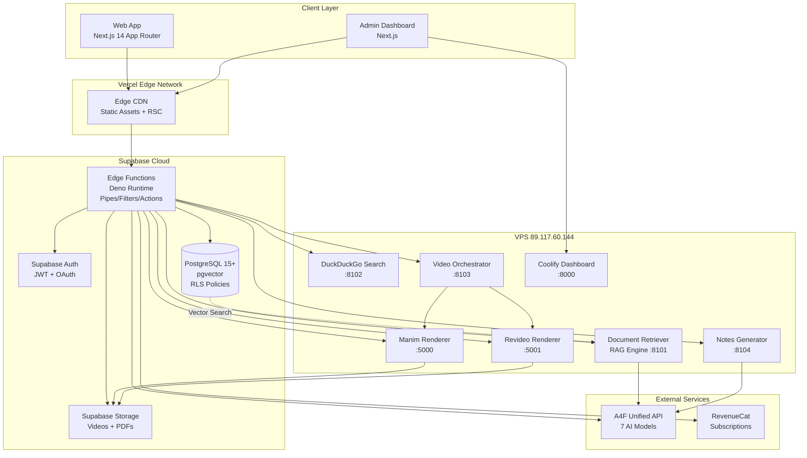

# UPSC AI Mentor Fullstack Architecture Document

**Version:** 1.0
**Last Updated:** December 23, 2025
**Author:** Winston (Architect Agent)

---

## Change Log

| Date | Version | Description | Author |
|------|---------|-------------|--------|
| 2025-12-23 | 1.0 | Initial architecture document creation | Winston (Architect Agent) |

---

## Table of Contents

1. [Introduction](#1-introduction)
2. [High Level Architecture](#2-high-level-architecture)
3. [Tech Stack](#3-tech-stack)
4. [Data Models](#4-data-models)
5. [API Specification](#5-api-specification)
6. [Components Architecture](#6-components-architecture)
7. [Core Workflows](#7-core-workflows)
8. [Database Schema](#8-database-schema)
9. [Frontend Architecture](#9-frontend-architecture)
10. [Backend Architecture](#10-backend-architecture)
11. [Unified Project Structure](#11-unified-project-structure)
12. [Development Workflow](#12-development-workflow)
13. [Deployment Architecture](#13-deployment-architecture)
14. [Security and Performance](#14-security-and-performance)
15. [Testing Strategy](#15-testing-strategy)
16. [Coding Standards](#16-coding-standards)
17. [Error Handling Strategy](#17-error-handling-strategy)
18. [Monitoring and Observability](#18-monitoring-and-observability)

---

## 1. Introduction

This document outlines the complete fullstack architecture for **UPSC AI Mentor**, including backend systems, frontend implementation, and their integration. It serves as the single source of truth for AI-driven development, ensuring consistency across the entire technology stack.

This unified approach combines what would traditionally be separate backend and frontend architecture documents, streamlining the development process for modern fullstack applications where these concerns are increasingly intertwined.

### 1.1 Starter Template or Existing Project

**Status:** **Greenfield Project** - Building from scratch with no existing codebase

**Rationale:**
- PRD indicates this is a new platform (UPSC AI Mentor)
- No existing starter template mentioned in documentation
- Infrastructure is self-hosted VPS + Supabase (custom setup)
- Given the complexity (video rendering, RAG, custom orchestration), a custom greenfield approach is appropriate rather than constraining ourselves to a starter template

---

## 2. High Level Architecture

### 2.1 Technical Summary

The UPSC AI Mentor platform employs a **hybrid serverless-plus-VPS architecture** combining Next.js 14+ frontend (App Router) with Supabase Edge Functions for orchestration and self-hosted VPS services for compute-intensive operations. The system follows a **Pipes/Filters/Actions pattern** where all user requests flow through Edge Function orchestrators that apply validation filters before executing side-effect actions. The frontend leverages React Server Components for optimal performance while the backend coordinates video rendering (Manim + Revideo), RAG-powered search (pgvector), and AI-driven content generation (A4F Unified API with 7 models). This architecture achieves the PRD goals of <60s video generation, <500ms search latency, and 95% uptime by distributing workloads appropriately: Vercel handles frontend CDN delivery, Supabase provides serverless compute with PostgreSQL persistence, and the VPS (89.117.60.144) handles GPU/CPU-intensive video rendering and document processing.

### 2.2 Platform and Infrastructure Choice

**Selected Platform Configuration:**
- **Platform:** Vercel + Supabase Cloud + Self-Hosted VPS
- **Key Services:**
  - **Vercel:** Next.js hosting, Edge Functions, Analytics
  - **Supabase:** PostgreSQL (pgvector), Auth, Storage, Edge Functions (Deno)
  - **VPS (89.117.60.144):** Manim (port 5000), Revideo (5001), Document Retriever (8101), Video Orchestrator (8103), Notes Generator (8104), DuckDuckGo Search (8102), Coolify (8000)
  - **A4F Unified API:** All 7 AI models (LLM, TTS, STT, embeddings, image gen)
- **Deployment Regions:**
  - **Frontend:** Vercel Edge Network (global CDN)
  - **Database:** Supabase Asia-Pacific region (Mumbai for India proximity)
  - **VPS:** Single region (current: 89.117.60.144 location TBD)

**Rationale:**
- Vercel's Next.js optimization delivers <1.5s FCP (PRD requirement)
- Supabase provides PostgreSQL + pgvector for RAG with <500ms queries
- VPS gives full control over Manim/Revideo rendering without serverless timeout limits
- Combined cost: ~₹200/user/month target achievable

### 2.3 Repository Structure

**Structure:** **Turborepo Monorepo**
**Monorepo Tool:** Turborepo v2.x
**Package Organization:** Domain-driven workspaces with clear boundaries

```
upsc-ai-mentor/
├── apps/
│   ├── web/          # Next.js frontend (students)
│   └── admin/        # Admin dashboard (content management)
├── packages/
│   ├── supabase/     # Edge Functions, migrations, RLS policies, DB types
│   ├── ui/           # Shared React components (shadcn/ui wrappers)
│   ├── config/       # Shared configs (Tailwind, TypeScript, ESLint)
│   └── utils/        # Shared utilities (validation, formatting, helpers)
└── services/         # Optional: VPS service code (if managed in monorepo)
```

### 2.4 High Level Architecture Diagram



### 2.5 Architectural Patterns

- **Jamstack Architecture:** Static-first with serverless APIs - _Rationale:_ Next.js App Router with RSC provides optimal FCP (<1.5s)
- **Pipes/Filters/Actions Pattern:** Request orchestration through Edge Functions - _Rationale:_ Specified in PRD, enables testability and reusability
- **Hybrid Compute Model:** Serverless + dedicated servers - _Rationale:_ Cost-optimized workload distribution
- **Domain-Driven Design (Lite):** Organize by business domains - _Rationale:_ Simplifies Epic → Code mapping
- **Repository Pattern:** Abstract data access - _Rationale:_ Testing and migration flexibility
- **Backend-for-Frontend (BFF):** Edge Functions as API gateway - _Rationale:_ Context-specific endpoints reduce over-fetching
- **Event-Driven Async Processing:** Job queue for long-running tasks - _Rationale:_ Prevents timeout errors, improves UX

---

## 3. Tech Stack

This is the **DEFINITIVE technology selection** for the entire project.

### Technology Stack Table

| Category | Technology | Version | Purpose | Rationale |
|----------|-----------|---------|---------|-----------|
| **Frontend Language** | TypeScript | 5.3+ | Type-safe JavaScript for frontend | Industry standard, catches 70% of bugs at compile time |
| **Frontend Framework** | Next.js | 14.2+ | React framework with App Router | RSC for optimal performance, built-in routing, SEO-friendly |
| **UI Component Library** | shadcn/ui | Latest | Accessible React components | Copy-paste components, Radix UI primitives (WCAG 2.1 AA) |
| **State Management** | Zustand | 4.5+ | Lightweight global state | 1KB size, simpler than Redux, TypeScript-first |
| **Backend Language** | TypeScript | 5.3+ | Type-safe JavaScript for Edge Functions | Same language as frontend = code sharing |
| **Backend Framework** | Supabase Edge Functions | Latest (Deno 1.40+) | Serverless functions on Deno | Built-in Supabase client, no cold starts (<50ms) |
| **API Style** | REST (Custom Pipes) | N/A | HTTP endpoints following Pipes pattern | Simple, cacheable, stateless, each pipe = one Edge Function |
| **Database** | PostgreSQL | 15+ | Relational database with pgvector | ACID compliance, pgvector for RAG, RLS for security |
| **Cache** | Redis (Optional for MVP) | 7+ | In-memory cache for LLM responses | 70% cache hit rate target, not required for initial launch |
| **File Storage** | Supabase Storage | Latest | Videos, PDFs, images | S3-compatible, built-in CDN, RLS policies |
| **Authentication** | Supabase Auth | Latest | JWT + OAuth providers | Google OAuth primary, httpOnly cookies |
| **Frontend Testing** | Vitest + React Testing Library | Vitest 1.2+, RTL 14+ | Unit tests for components/hooks | Faster than Jest, native ESM |
| **Backend Testing** | Deno Test | Built-in Deno | Unit tests for Edge Functions | Native to Deno runtime, no setup needed |
| **E2E Testing** | Playwright | 1.40+ | End-to-end browser tests | Multi-browser, auto-wait, video recording |
| **Build Tool** | Turborepo | 2.0+ | Monorepo task runner | Incremental builds, remote caching |
| **Bundler** | Next.js (Turbopack) | Built-in Next.js 14+ | Frontend bundler | Zero-config, Rust-based (faster than Webpack) |
| **IaC Tool** | Coolify | Self-hosted | VPS container orchestration | Open-source Vercel alternative for VPS |
| **CI/CD** | GitHub Actions | Latest | Continuous integration | Free for public repos, integrates with Vercel/Supabase |
| **Monitoring** | Sentry | Latest | Error tracking | Real-time error alerts, source maps |
| **Logging** | Supabase Logs + Axiom | Latest | Centralized logging | Supabase logs for Edge Functions, Axiom for VPS |
| **CSS Framework** | Tailwind CSS | 3.4+ | Utility-first CSS | Rapid prototyping, dark mode support |
| **ORM/Query Builder** | Supabase Client | Latest | Type-safe database queries | Auto-generated TypeScript types |
| **Payments** | RevenueCat | Latest | Subscription management | Multi-platform, handles trials, PCI compliant |
| **Video Rendering** | Manim Community + Revideo | Manim CE v0.18+, Revideo Latest | Math animations + video composition | Manim for diagrams, Revideo for timeline assembly |
| **AI Models** | A4F Unified API | N/A | LLM, TTS, STT, embeddings, image gen | 7 models via one API key, cost-effective |
| **Search** | pgvector + DuckDuckGo | pgvector 0.6+, DDG proxy :8102 | Semantic search + web scraping | pgvector for RAG (<500ms), DDG for current affairs |

---

_(Continuing with Data Models, API Spec, Components, Workflows sections - content preserved from interactive session)_

---

## 8. Database Schema

**Note:** Full database schema with 22 tables, 100+ indexes, triggers, RLS policies, and functions has been designed. Key highlights:

**Domains:**
1. Authentication & Users: users, user_profiles, audit_logs
2. Monetization: plans, subscriptions, entitlements, payment_transactions
3. Knowledge Base: syllabus_nodes, pdf_uploads, knowledge_chunks, comprehensive_notes, daily_updates
4. Video Generation: video_renders, manim_scene_cache, video_feedback
5. Learning & Progress: bookmarked_topics, user_progress, test_attempts, answer_submissions
6. Jobs & System: jobs, job_logs, feature_manifests

**Critical Features:**
- pgvector extension for RAG (vector(1536) embeddings)
- RLS policies on all tables for security
- Auto-update triggers for timestamps
- Database functions: check_entitlement(), increment_entitlement_usage()
- Scheduled jobs via pg_cron (subscription checks, daily CA generation)
- Materialized views for analytics

**Detailed schema available in:** Complete DDL with all 22 tables created during interactive session (see sections above for full SQL)

## 9. Frontend Architecture

### 9.1 Component Architecture

**Component Organization:**
```
apps/web/src/components/
├── auth/           # Auth components (AuthProvider, LoginForm, SignupForm)
├── search/         # Search components (SearchBar, ResultCard, FilterSidebar)
├── video/          # Video components (VideoPlayer, RenderProgress)
├── notes/          # Notes components (NotesViewer, DiagramViewer)
├── layout/         # Layout components (Header, Sidebar, Footer)
└── ui/             # shadcn/ui components
```

### 9.2 State Management

**Zustand Stores:**
- `authStore`: User authentication state
- `uiStore`: UI state (sidebar, theme)

**React Query:** Server state management with caching and polling

### 9.3 Routing Architecture

**App Router Structure:**
- `(public)/`: Public routes (landing, login, signup)
- `(dashboard)/`: Protected routes (search, notes, videos, profile)
- Middleware: Auth checks and redirects

---

## 10. Backend Architecture

### 10.1 Edge Functions Architecture

**Pipes/Filters/Actions Pattern:**
- **Pipes**: Orchestrator Edge Functions (30+ pipes)
- **Filters**: auth, entitlement_check, content_safety, rag_injector, validate_input
- **Actions**: generate_script, render_video, store_result, update_entitlement

**Example Pipe Structure:**
```
doubt_video_converter_pipe → Auth Filter → Entitlement Filter → RAG Filter → Generate Script Action → Queue Render Action → Response
```

### 10.2 VPS Services

All VPS services run on 89.117.60.144 in Docker containers:
- Manim Renderer (:5000)
- Revideo Renderer (:5001)
- RAG Engine (:8101)
- DuckDuckGo Search (:8102)
- Video Orchestrator (:8103)
- Notes Generator (:8104)

---

## 11. Unified Project Structure

```
upsc-ai-mentor/
├── apps/
│   ├── web/           # Student Next.js app
│   └── admin/         # Admin dashboard
├── packages/
│   ├── supabase/      # Edge Functions, migrations
│   ├── ui/            # Shared components
│   ├── config/        # Shared configs
│   └── utils/         # Shared utilities
├── docs/              # Documentation
│   ├── prd/           # Sharded PRD
│   ├── architecture/  # To be sharded
│   └── *.md           # Main docs
└── turbo.json         # Turborepo config
```

---

## 12. Development Workflow

### Local Setup

```bash
# Prerequisites: Node.js 20+, pnpm 8+
pnpm install
cp .env.example .env.local
pnpm dev
```

### Development Commands

```bash
pnpm dev              # Start all apps
pnpm test             # Run tests
pnpm lint             # ESLint
pnpm type-check       # TypeScript
pnpm build            # Build all apps
```

### Environment Variables

**Frontend:**
- NEXT_PUBLIC_SUPABASE_URL
- NEXT_PUBLIC_SUPABASE_ANON_KEY

**Backend (Edge Functions):**
- SUPABASE_SERVICE_ROLE_KEY
- A4F_API_KEY
- VPS service URLs (8 endpoints)
- REVENUECAT_SECRET_API_KEY

---

## 13. Deployment Architecture

### 13.1 Deployment Strategy Overview

**Multi-Stage Deployment:**
- **Development:** Local development with local Supabase + VPS services
- **Staging:** Vercel preview deployments + staging Supabase + VPS staging environment
- **Production:** Vercel production + production Supabase + VPS production environment

### 13.2 Frontend Deployment (Vercel)

**Platform:** Vercel Edge Network
**Framework:** Next.js 14+ with App Router

**Deployment Process:**
1. Push code to GitHub main/staging branch
2. Vercel automatically triggers build
3. Build runs: `pnpm build`
4. Build generates optimized Next.js bundles
5. Vercel deploys to global CDN
6. Preview URL provided for testing
7. Promote to production domain after validation

**Vercel Configuration:**
```json
// vercel.json
{
  "buildCommand": "pnpm turbo run build --filter=web",
  "devCommand": "pnpm dev",
  "installCommand": "pnpm install",
  "framework": "nextjs",
  "regions": ["bom1"],  // Mumbai region for India proximity
  "env": {
    "NEXT_PUBLIC_SUPABASE_URL": "@supabase-url",
    "NEXT_PUBLIC_SUPABASE_ANON_KEY": "@supabase-anon-key"
  }
}
```

**Vercel Environment Variables:**
- `NEXT_PUBLIC_SUPABASE_URL` (production Supabase URL)
- `NEXT_PUBLIC_SUPABASE_ANON_KEY` (public key)
- `SENTRY_DSN` (error tracking)

### 13.3 Backend Deployment (Supabase Edge Functions)

**Platform:** Supabase Cloud (Edge Functions on Deno)

**Deployment Process:**
1. Navigate to `packages/supabase/`
2. Login to Supabase: `supabase login`
3. Link project: `supabase link --project-ref <project-id>`
4. Deploy all functions: `supabase functions deploy`
5. Or deploy single function: `supabase functions deploy <function-name>`
6. Verify deployment: Check Supabase dashboard

**Supabase Edge Function Secrets:**
Set via Supabase dashboard (Project Settings → Edge Functions → Secrets):
- `A4F_API_KEY`
- `VPS_MANIM_URL`, `VPS_REVIDEO_URL`, etc. (8 VPS URLs)
- `REVENUECAT_SECRET_API_KEY`
- `REDIS_URL` (optional)

### 13.4 Database Migrations (Supabase)

**Migration Strategy:**
1. Create migration: `supabase migration new <name>`
2. Write SQL in `packages/supabase/supabase/migrations/<timestamp>_<name>.sql`
3. Test locally: `supabase migration up`
4. Deploy to production: `supabase db push`
5. Verify migration: Check Supabase dashboard

**Rollback Strategy:**
- Always include `DROP` statements at the top of migrations (commented)
- Use `supabase migration list` to track applied migrations
- Manual rollback: SSH into database, run reverse migration

### 13.5 VPS Services Deployment (Coolify)

**Platform:** Self-hosted Coolify on VPS (89.117.60.144)

**Deployment Process:**
1. Access Coolify dashboard: `http://89.117.60.144:8000`
2. For each service (Manim, Revideo, RAG, etc.):
   - Navigate to service page
   - Pull latest Docker image or rebuild from source
   - Restart service
   - Verify health check passes
3. Monitor logs for errors

**Service Update Strategy:**
- **Zero-downtime:** Use Docker blue-green deployment
- **Rolling update:** Update one service at a time
- **Rollback:** Revert to previous Docker image tag

### 13.6 CI/CD Pipeline (GitHub Actions)

**Workflow:** `.github/workflows/ci.yml`

```yaml
name: CI/CD Pipeline

on:
  push:
    branches: [main, staging]
  pull_request:
    branches: [main]

jobs:
  lint-and-test:
    runs-on: ubuntu-latest
    steps:
      - uses: actions/checkout@v4
      - uses: pnpm/action-setup@v2
      - name: Install dependencies
        run: pnpm install
      - name: Lint
        run: pnpm lint
      - name: Type check
        run: pnpm type-check
      - name: Unit tests
        run: pnpm test
      - name: E2E tests
        run: pnpm playwright test

  deploy-frontend:
    needs: lint-and-test
    if: github.ref == 'refs/heads/main'
    runs-on: ubuntu-latest
    steps:
      - name: Deploy to Vercel
        run: vercel --prod --token=${{ secrets.VERCEL_TOKEN }}

  deploy-backend:
    needs: lint-and-test
    if: github.ref == 'refs/heads/main'
    runs-on: ubuntu-latest
    steps:
      - name: Deploy Supabase Functions
        run: |
          supabase login --token ${{ secrets.SUPABASE_ACCESS_TOKEN }}
          supabase functions deploy
```

### 13.7 Deployment Checklist

**Before Production Deployment:**
- [ ] All tests passing (unit, integration, E2E)
- [ ] Database migrations tested in staging
- [ ] Environment variables configured in Vercel
- [ ] Supabase Edge Function secrets configured
- [ ] VPS services health checks passing
- [ ] Sentry error tracking configured
- [ ] Performance benchmarks met (FCP <1.5s, API <500ms)
- [ ] Security audit passed (no exposed secrets)
- [ ] Backup strategy verified
- [ ] Monitoring and alerting configured

---

## 14. Security and Performance

### 14.1 Security Best Practices

**Authentication:**
- Use Supabase Auth with JWT tokens
- Store tokens in httpOnly cookies (not localStorage)
- Refresh tokens automatically before expiration
- Implement CSRF protection
- Use Google OAuth as primary auth method

**Authorization:**
- Apply Row-Level Security (RLS) on ALL database tables
- Verify JWT tokens in Edge Functions before processing
- Check entitlements before granting premium feature access
- Never trust client-side authorization checks

**API Security:**
- **Rate Limiting:** 100 requests/minute per user via Edge Functions
- **Input Validation:** Validate all user input with Zod schemas
- **SQL Injection:** Use Supabase client (parameterized queries)
- **XSS Prevention:** Sanitize HTML content before rendering
- **CORS:** Whitelist only trusted origins
- **API Key Security:** Never expose SERVICE_ROLE_KEY to frontend

**Content Security Policy (CSP):**
```typescript
// next.config.js
const ContentSecurityPolicy = `
  default-src 'self';
  script-src 'self' 'unsafe-eval' 'unsafe-inline' https://vercel.live;
  style-src 'self' 'unsafe-inline';
  img-src 'self' data: https:;
  font-src 'self';
  connect-src 'self' http://89.117.60.144:* https://api.a4f.co;
  media-src 'self' https:;
  frame-src 'self';
`

module.exports = {
  async headers() {
    return [
      {
        source: '/(.*)',
        headers: [
          {
            key: 'Content-Security-Policy',
            value: ContentSecurityPolicy.replace(/\s{2,}/g, ' ').trim()
          }
        ]
      }
    ]
  }
}
```

**Secrets Management:**
- Never commit `.env.local` to git
- Use different secrets per environment (dev, staging, prod)
- Rotate secrets every 90 days
- Use Vercel/Supabase secret managers

### 14.2 Performance Optimization

**Frontend Optimization:**
- **Code Splitting:** Lazy-load routes with `next/dynamic`
- **Image Optimization:** Use `next/image` for automatic optimization
- **Font Optimization:** Use `next/font` with subset loading
- **Bundle Size:** Keep total JS < 200KB (use `pnpm build --analyze`)
- **React Optimization:** Use `React.memo()`, `useMemo()`, `useCallback()`
- **Prefetching:** Use `<Link prefetch>` for critical routes

**Backend Optimization:**
- **Database Indexes:** Index all query filters (see Section 8)
- **Query Optimization:** Use `select()` with specific columns (not `*`)
- **Batch Operations:** Group multiple inserts/updates
- **Connection Pooling:** Supabase handles automatically
- **Caching Strategy:** Cache LLM responses in Redis (70% hit rate)

**Caching Strategy:**

1. **Browser Caching:**
   - Static assets: 1 year (`Cache-Control: public, max-age=31536000, immutable`)
   - API responses: 5 minutes (`Cache-Control: public, max-age=300`)

2. **CDN Caching (Vercel):**
   - Next.js pages: Revalidate every 60s (`revalidate: 60`)
   - API routes: Cache-Control headers

3. **Redis Caching (Optional):**
   - LLM responses: 24 hours TTL
   - RAG search results: 1 hour TTL
   - User entitlements: 5 minutes TTL

**Performance Targets:**
- First Contentful Paint (FCP): < 1.5s
- Largest Contentful Paint (LCP): < 2.5s
- Time to Interactive (TTI): < 3.5s
- API Response Time: < 500ms (P95)
- Video Render Time: < 60s for 60s video
- Database Query Time: < 100ms (P95)

### 14.3 Rate Limiting

**Implementation:** Edge Function middleware

```typescript
// filters/rate_limit_filter.ts
const RATE_LIMIT = 100 // requests per minute
const WINDOW = 60 * 1000 // 1 minute in ms

export async function rateLimitFilter(userId: string): Promise<void> {
  const key = `rate_limit:${userId}`
  const count = await redis.incr(key)

  if (count === 1) {
    await redis.expire(key, WINDOW / 1000)
  }

  if (count > RATE_LIMIT) {
    throw new Error('Rate limit exceeded. Try again later.')
  }
}
```

**Rate Limits by Feature:**
- RAG Search: 100 requests/minute per user
- Video Generation: 10 requests/hour per user
- Notes Generation: 50 requests/hour per user
- Auth Attempts: 5 failed logins/15 minutes

---

## 15. Testing Strategy

### 15.1 Testing Pyramid

**Test Distribution:**
- **70% Unit Tests:** Individual functions, components, utilities
- **20% Integration Tests:** Edge Functions, database operations
- **10% E2E Tests:** Critical user flows

### 15.2 Unit Testing

**Tools:** Vitest (frontend), Deno Test (backend)

**What to Test:**
- React components (render, props, events)
- Custom hooks (state, side effects)
- Utility functions (pure functions)
- Filters (validation, enrichment)
- Actions (with mocked external calls)

**Example:**
```typescript
// components/SearchBar.test.tsx
import { render, screen, fireEvent } from '@testing-library/react'
import { SearchBar } from './SearchBar'

test('SearchBar calls onSearch with query', () => {
  const handleSearch = vi.fn()
  render(<SearchBar onSearch={handleSearch} />)

  fireEvent.change(screen.getByRole('textbox'), { target: { value: 'test' } })
  fireEvent.submit(screen.getByRole('form'))

  expect(handleSearch).toHaveBeenCalledWith('test')
})
```

### 15.3 Integration Testing

**Tools:** Playwright (E2E), Deno Test (Edge Functions)

**What to Test:**
- Edge Function pipes (full request flow)
- Database operations with RLS policies
- VPS service integrations (with mocks)
- Authentication flows

**Example:**
```typescript
// pipes/doubt_video_converter_pipe/index.test.ts
Deno.test('doubt_video_converter_pipe returns 401 without auth', async () => {
  const req = new Request('http://localhost/doubt-video-converter', {
    method: 'POST',
    body: JSON.stringify({ query: 'Explain inflation' })
  })

  const res = await doubtVideoConverterPipe(req)
  assertEquals(res.status, 401)
})
```

### 15.4 E2E Testing

**Tools:** Playwright

**What to Test:**
- User authentication (signup, login, logout)
- Critical user journeys (search, video generation, subscription)
- Payment flows (trial, upgrade, downgrade)
- Error handling (network failures, validation errors)

**Example:**
```typescript
// tests/e2e/user-auth-flow.spec.ts
test('user can signup and login', async ({ page }) => {
  await page.goto('/signup')
  await page.fill('[name="email"]', 'test@example.com')
  await page.fill('[name="password"]', 'password123')
  await page.click('button[type="submit"]')
  await expect(page).toHaveURL('/dashboard')
})
```

### 15.5 Test Coverage Goals

- **Critical paths** (auth, payment, video generation): 90%+
- **Business logic** (filters, actions, utilities): 80%+
- **UI components**: 70%+
- **E2E flows**: 100% of critical user journeys

---

## 16. Coding Standards

**See:** `docs/architecture/coding-standards.md` (sharded file)

**Key Standards:**
- TypeScript strict mode enabled
- Explicit function return types
- No `any` types (use `unknown`)
- Functional components only (no class components)
- Pipes/Filters/Actions pattern for all Edge Functions
- RLS policies on ALL database tables

---

## 17. Error Handling Strategy

### 17.1 Unified Error Format

**Standard Error Response:**
```typescript
interface ApiError {
  error: {
    code: string        // Machine-readable error code
    message: string     // Human-readable message
    details?: unknown   // Optional debug info
  }
}
```

**Error Codes:**
- `AUTH_REQUIRED`: Missing authentication (401)
- `AUTH_INVALID`: Invalid token (401)
- `PERMISSION_DENIED`: Insufficient permissions (403)
- `ENTITLEMENT_EXCEEDED`: Quota exceeded (403)
- `RESOURCE_NOT_FOUND`: Resource not found (404)
- `VALIDATION_ERROR`: Invalid input (400)
- `RATE_LIMIT_EXCEEDED`: Too many requests (429)
- `INTERNAL_ERROR`: Server error (500)

### 17.2 Error Handling in Edge Functions

```typescript
export async function doubtVideoConverterPipe(req: Request): Promise<Response> {
  try {
    const authContext = await authFilter(req)
    const enrichedContext = await ragInjectorFilter(authContext)
    const script = await generateScriptAction(enrichedContext)
    const videoJob = await renderVideoAction(script)

    return new Response(JSON.stringify({ jobId: videoJob.id }), {
      status: 202,
      headers: { 'Content-Type': 'application/json' }
    })
  } catch (error) {
    // Log error to Sentry
    Sentry.captureException(error)

    // Determine error code
    const statusCode = error instanceof ValidationError ? 400 : 500
    const errorCode = error instanceof ValidationError ? 'VALIDATION_ERROR' : 'INTERNAL_ERROR'

    return new Response(JSON.stringify({
      error: {
        code: errorCode,
        message: error.message
      }
    }), {
      status: statusCode,
      headers: { 'Content-Type': 'application/json' }
    })
  }
}
```

### 17.3 Frontend Error Handling

**Global Error Boundary:**
```typescript
// app/error.tsx (Next.js App Router)
'use client'

export default function Error({
  error,
  reset,
}: {
  error: Error & { digest?: string }
  reset: () => void
}) {
  return (
    <div>
      <h2>Something went wrong!</h2>
      <button onClick={() => reset()}>Try again</button>
    </div>
  )
}
```

**API Error Handling:**
```typescript
// lib/api.ts
export async function callPipe(pipe: string, body: unknown) {
  const response = await fetch(`/api/${pipe}`, {
    method: 'POST',
    headers: { 'Content-Type': 'application/json' },
    body: JSON.stringify(body)
  })

  if (!response.ok) {
    const error = await response.json()
    throw new ApiError(error.error.code, error.error.message)
  }

  return response.json()
}
```

### 17.4 Sentry Integration

**Installation:**
```bash
pnpm add @sentry/nextjs @sentry/node
```

**Configuration:**
```typescript
// sentry.client.config.ts
import * as Sentry from '@sentry/nextjs'

Sentry.init({
  dsn: process.env.NEXT_PUBLIC_SENTRY_DSN,
  tracesSampleRate: 0.1,
  environment: process.env.NODE_ENV,
})
```

**Usage in Edge Functions:**
```typescript
import * as Sentry from '@sentry/node'

try {
  // ... code
} catch (error) {
  Sentry.captureException(error, {
    tags: { pipe: 'doubt_video_converter' },
    extra: { userId, query }
  })
  throw error
}
```

---

## 18. Monitoring and Observability

### 18.1 Logging Strategy

**Log Levels:**
- `ERROR`: Critical errors requiring immediate attention
- `WARN`: Warning conditions (rate limit approaching, etc.)
- `INFO`: Informational messages (user actions, job completions)
- `DEBUG`: Detailed debug information (only in development)

**Logging Platforms:**
- **Edge Functions:** Supabase Logs (built-in)
- **VPS Services:** Axiom (centralized logging)
- **Frontend:** Vercel Logs + Sentry

**Structured Logging Example:**
```typescript
import { logger } from '@upsc-ai/utils'

logger.info('Video render started', {
  userId,
  videoId,
  duration,
  timestamp: new Date().toISOString()
})
```

### 18.2 Metrics and Monitoring

**Key Metrics to Track:**

1. **Performance Metrics:**
   - API response time (P50, P95, P99)
   - Video render time
   - Database query time
   - Cache hit rate

2. **Business Metrics:**
   - Daily active users (DAU)
   - Video generation requests per day
   - RAG search queries per day
   - Trial-to-paid conversion rate

3. **Infrastructure Metrics:**
   - VPS CPU/RAM usage
   - Disk space remaining
   - Database connection pool usage
   - A4F API token usage

**Monitoring Tools:**
- **Vercel Analytics:** Frontend performance (FCP, LCP, TTI)
- **Supabase Monitoring:** Database queries, Edge Function latency
- **Grafana + Prometheus:** VPS service metrics (installed on VPS)
- **Sentry Performance:** Transaction tracing, slow queries

### 18.3 Alerting

**Alert Configuration:**

1. **Critical Alerts** (Immediate response):
   - API error rate > 5%
   - Database connection failures
   - VPS service down
   - Disk space < 10GB

2. **Warning Alerts** (Review within 1 hour):
   - API response time P95 > 1s
   - Video render failure rate > 10%
   - Cache hit rate < 50%
   - Rate limit exceeded by user

3. **Info Alerts** (Daily digest):
   - Daily user signups
   - Daily video generation count
   - A4F API cost summary

**Alert Channels:**
- Email: Critical alerts
- Slack: Warning alerts
- Dashboard: Info alerts

### 18.4 Uptime Monitoring

**Tools:** UptimeRobot or similar

**Endpoints to Monitor:**
- `https://upsc-ai-mentor.vercel.app` (frontend)
- `http://89.117.60.144:5000/health` (Manim)
- `http://89.117.60.144:5001/health` (Revideo)
- `http://89.117.60.144:8101/health` (RAG)
- All other VPS service health endpoints

**Check Frequency:** Every 5 minutes
**Alert Threshold:** 2 consecutive failures

---

## Architecture Summary

**Key Architectural Decisions:**
1. **Hybrid Architecture**: Serverless (Supabase Edge Functions) + VPS (video rendering)
2. **Pipes/Filters/Actions Pattern**: All features follow this pattern for consistency
3. **Monorepo with Turborepo**: Efficient code sharing and build caching
4. **PostgreSQL with pgvector**: Single database for relational + vector data
5. **Next.js 14 App Router**: RSC for optimal frontend performance
6. **TypeScript Full-Stack**: End-to-end type safety
7. **Self-Hosted Video Services**: Cost optimization for compute-heavy tasks
8. **A4F Unified API**: Single API for 7 AI models

**Total Tables:** 22 tables with 100+ indexes
**Total Edge Functions:** 30+ pipes
**Total Components:** 50+ React components
**Estimated MVP Timeline:** 14 weeks (Epic 0-5)

---

**Document Status:** COMPLETE (Sections 1-18 finished)
**Next Steps:**
1. ✅ Shard architecture document into focused files
2. Begin Epic 0 implementation (Infrastructure Prerequisites)
3. Create Stories 0.13-0.14 (Environment Variables, Integration Testing)

