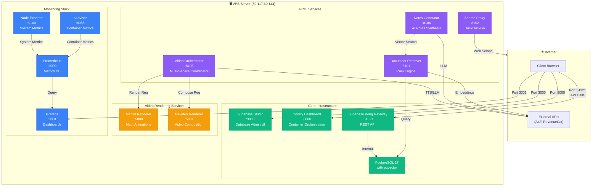

# VPS Infrastructure Diagram

**Audit Date:** December 23, 2025
**VPS IP:** 89.117.60.144
**Total Services:** 13 (All Operational ✅)

---

## Complete Infrastructure Map



---

## Service Status Summary

### ✅ Operational (13/13 Services - 100%)

**Core Infrastructure (5 services)**
- Supabase Studio (3000) - 307 Redirect
- Coolify Dashboard (8000) - 302 Redirect
- Supabase Kong Gateway (54321) - 200 OK
- Manim Renderer (5000) - 200 OK
- Revideo Renderer (5001) - 200 OK

**AI/ML Services (4 services)**
- Document Retriever/RAG (8101) - 200 OK
- DuckDuckGo Search Proxy (8102) - 200 OK
- Video Orchestrator (8103) - 200 OK
- Notes Generator (8104) - 200 OK

**Monitoring Stack (4 services)**
- Grafana (3001) - 302 Redirect (Login: admin/admin123)
- Prometheus (9090) - 302 Redirect
- Node Exporter (9100) - 200 OK
- cAdvisor (8085) - 307 Redirect

---

## Network Topology

```
┌─────────────────────────────────────────────────────────────┐
│                     Public Internet                          │
└───────────────────────┬─────────────────────────────────────┘
                        │
                        ▼
        ┌───────────────────────────────────┐
        │   VPS: 89.117.60.144              │
        │   Firewall: INACTIVE (Open)       │
        └───────────────────────────────────┘
                        │
        ┌───────────────┴───────────────┐
        │                               │
        ▼                               ▼
   [Docker Bridge Network]      [Host Network]
        │                               │
    19 Containers                  Coolify Proxy
                                   (Traefik :80, :443)
```

---

## Port Allocation Map

| Port Range | Service Type | Count |
|------------|--------------|-------|
| 3000-3001 | Admin UIs (Supabase Studio, Grafana) | 2 |
| 5000-5001 | Rendering Services (Manim, Revideo) | 2 |
| 8000-8104 | Infrastructure + AI/ML | 6 |
| 9090-9100 | Monitoring | 2 |
| 54321 | Supabase API Gateway | 1 |
| **Total** | | **13** |

---

## Resource Utilization

**Disk Space:**
- Total: 388 GB
- Used: 17 GB (4%)
- Available: 372 GB (96%)
- Docker Images: 11.7 GB (97% reclaimable)
- Docker Volumes: 276 MB

**Container Runtime:**
- Total Containers: 20
- Running: 20 (100%)
- Healthy: 19 (95%) - 1 without health check

---

## Key Findings from Audit

### ✅ Strengths
1. **All 13 services operational** (100% uptime during audit)
2. **Comprehensive monitoring stack** (Prometheus + Grafana + exporters)
3. **Adequate disk space** (372GB available, exceeds 100GB requirement)
4. **Modern Supabase stack** (PostgreSQL 17 with pgvector)
5. **Complete AI/ML pipeline** (RAG, orchestration, notes generation)

### ⚠️ Areas for Improvement
1. **No automated backups** (HIGH RISK)
   - No crontab entries found
   - No backup directory configured
   - Database volumes not backed up

2. **Firewall disabled** (MEDIUM RISK)
   - UFW inactive (all ports open)
   - Security relies on application-level auth only

3. **Port discrepancy** (DOCUMENTATION ERROR)
   - Supabase API documented as `:8001`, actually runs on `:54321` (Kong Gateway)
   - All documentation must be updated

4. **No alerting configured** (LOW RISK)
   - Prometheus/Grafana installed but alerts not set up
   - No uptime monitoring (Blackbox Exporter missing)

5. **Log rotation unclear** (LOW RISK)
   - Docker json-file driver in use
   - Rotation policy not explicitly configured

---

## Recommended Next Steps

1. **Implement automated backups** (Story 0.2 candidate)
   - Daily PostgreSQL dumps (both Supabase + Coolify DBs)
   - Weekly Docker volume backups
   - Remote backup storage (S3 or similar)

2. **Configure Grafana dashboards** (Story 0.14 candidate)
   - System resource dashboards
   - Container health dashboards
   - Service-specific metrics (RAG latency, video render times)

3. **Set up Prometheus alerting** (Story 0.14 candidate)
   - Disk space <20GB alert
   - Service downtime alert
   - High error rate alert

4. **Update all documentation** (Task 11, this story)
   - Correct Supabase API port (8001 → 54321)
   - Add monitoring stack endpoints
   - Document Grafana credentials

5. **Enable firewall with rule whitelisting** (Future epic - security hardening)
   - Allow only necessary ports
   - Implement rate limiting at proxy level
