# UPSC AI Mentor - Neon Glass UI/UX Specification

**Version:** 1.0
**Last Updated:** December 23, 2025
**Author:** Sally (UX Expert Agent)
**Design Philosophy:** Intelligent Restraint - Apple-level restraint + sci-fi precision

---

## Change Log

| Date | Version | Description | Author |
|------|---------|-------------|--------|
| 2025-12-23 | 1.0 | Initial Neon Glass UX specification with shadcn/ui integration | Sally (UX Expert) |

---

## Table of Contents

1. [Introduction & Design Philosophy](#1-introduction--design-philosophy)
2. [Neon Glass Design System](#2-neon-glass-design-system)
3. [AI-Driven Dynamic Theming](#3-ai-driven-dynamic-theming)
4. [Component Library (shadcn/ui Customization)](#4-component-library-shadcnui-customization)
5. [Micro-Animations & Motion Guidelines](#5-micro-animations--motion-guidelines)
6. [Interactive Button Signature](#6-interactive-button-signature)
7. [Information Architecture](#7-information-architecture)
8. [Key Screen Specifications](#8-key-screen-specifications)
9. [Accessibility & Readability](#9-accessibility--readability)
10. [Responsive Strategy](#10-responsive-strategy)
11. [Performance Constraints](#11-performance-constraints)
12. [Implementation Guide](#12-implementation-guide)

---

## 1. Introduction & Design Philosophy

### 1.1 Design Mandate

**REALISTIC, BUILDABLE, FUTURE-READY UI** - Not concept art.

The interface must feel:
- **Futuristic but usable** - Sci-fi aesthetics never compromise functionality
- **Visually premium but readable** - WCAG 2.1 AA compliance is non-negotiable
- **Animated but never distracting** - Motion serves purpose, not decoration
- **Intelligent and context-aware** - AI-driven adaptive theming

### 1.2 Core UX Principles

1. **Intelligent Restraint** - Glassmorphism is structural, neon is intentional
2. **Content Always Wins** - If UI draws attention to itself, it has failed
3. **Adaptive by Design** - Theme responds to subject, mode, cognitive state
4. **Purposeful Motion** - Animations communicate state, guide attention, reinforce feedback
5. **Accessible Futurism** - Future-ready aesthetics, inclusive accessibility

### 1.3 Target User Personas

**Primary Persona: Working Professional UPSC Aspirant**
- Age: 25-32
- Study Time: 3-5 hours/day (limited)
- Device: Mobile-first (60% mobile, 40% desktop)
- Pain Points: Time scarcity, information overload, lack of personalization
- Goals: Efficient learning, quick doubt resolution, track progress

**Secondary Persona: Full-Time UPSC Student**
- Age: 22-26
- Study Time: 8-12 hours/day
- Device: Desktop-first (70% desktop, 30% mobile)
- Pain Points: Scattered resources, no practice feedback, weak revision strategy
- Goals: Comprehensive coverage, deep understanding, structured practice

**Tertiary Persona: Admin/Content Manager**
- Role: Upload PDFs, monitor system, review feedback
- Device: Desktop-only
- Goals: Efficient content management, system health visibility

---

## 2. Neon Glass Design System

### 2.1 Visual Foundation

**Base Philosophy:** Glassmorphism + Neon accents + Dark-first design

**Structural Principles:**
- Glass panels create depth hierarchy (foreground/background)
- Neon outlines define interactive boundaries
- Blur creates focus separation (blur foreground = background recedes)
- Gradient overlays add dimensionality without clutter

### 2.2 Color System (Tailwind CSS Custom Theme)

#### **2.2.1 Base Dark Mode Palette**

```css
/* tailwind.config.ts - Neon Glass Theme */
export default {
  darkMode: 'class',
  theme: {
    extend: {
      colors: {
        /* Base layers */
        background: {
          DEFAULT: 'hsl(240 10% 3.9%)',      /* Deep charcoal - #0a0a0f */
          secondary: 'hsl(240 8% 8%)',       /* Slightly lighter - #131318 */
        },

        /* Glass surfaces */
        glass: {
          light: 'hsla(240, 10%, 15%, 0.4)', /* Semi-transparent panels */
          medium: 'hsla(240, 10%, 12%, 0.6)',
          heavy: 'hsla(240, 10%, 10%, 0.8)',
        },

        /* Neon accents - Subject-based (Default: Cyan-Blue) */
        neon: {
          primary: 'hsl(187 100% 50%)',      /* Electric cyan - #00dfff */
          secondary: 'hsl(217 91% 60%)',     /* Bright blue - #3b82f6 */
          accent: 'hsl(280 100% 70%)',       /* Soft violet - #c77dff */
        },

        /* Semantic colors */
        success: 'hsl(142 76% 36%)',         /* Green - #10b981 */
        warning: 'hsl(38 92% 50%)',          /* Amber - #f59e0b */
        error: 'hsl(0 84% 60%)',             /* Red - #ef4444 */

        /* Text hierarchy */
        foreground: {
          DEFAULT: 'hsl(0 0% 98%)',          /* Near white - #fafafa */
          muted: 'hsl(240 5% 65%)',          /* Muted gray - #9ca3af */
          subtle: 'hsl(240 5% 45%)',         /* Subtle gray - #6b7280 */
        },

        /* Borders */
        border: {
          DEFAULT: 'hsla(240, 10%, 20%, 0.3)', /* Transparent gray */
          neon: 'hsla(187, 100%, 50%, 0.5)',   /* Glowing cyan border */
        },
      },

      /* Glassmorphism utilities */
      backdropBlur: {
        glass: '12px',
        'glass-heavy': '24px',
      },

      /* Box shadows for depth */
      boxShadow: {
        'glass': '0 8px 32px 0 rgba(31, 38, 135, 0.37)',
        'neon-sm': '0 0 10px rgba(0, 223, 255, 0.3)',
        'neon-md': '0 0 20px rgba(0, 223, 255, 0.4)',
        'neon-lg': '0 0 30px rgba(0, 223, 255, 0.5)',
      },
    },
  },
};
```

#### **2.2.2 AI-Driven Dynamic Color Themes**

**Theme Switching Logic:**

| Subject/Mode | Primary Neon | Secondary Neon | Gradient | Emotion |
|--------------|--------------|----------------|----------|---------|
| **Polity** | `hsl(187 100% 50%)` Cyan | `hsl(217 91% 60%)` Blue | Cyan → Blue | Calm, Structured |
| **Ethics** | `hsl(38 92% 50%)` Amber | `hsl(280 100% 70%)` Violet | Amber → Violet | Thoughtful, Balanced |
| **Geography** | `hsl(142 76% 50%)` Green | `hsl(200 100% 40%)` Deep Blue | Green → Ocean Blue | Natural, Exploratory |
| **Analytics** | `hsl(0 0% 20%)` Graphite | `hsl(187 100% 50%)` Teal | Monochrome + Teal | Precise, Data-focused |
| **Interview Mode** | `hsl(0 0% 90%)` White | `hsl(187 100% 50%)` Cyan Edge | Minimal + Cyan Accent | Focused, Professional |
| **Daily CA** | `hsl(25 95% 53%)` Orange | `hsl(340 82% 52%)` Pink | Sunrise gradient | Energetic, News-like |
| **Reading Mode** | `hsl(240 10% 15%)` Muted | `hsl(0 0% 70%)` Gray | Flat, reduced glow | Readable, Eye-friendly |

**Implementation (CSS Variables):**

```css
/* Dynamic theme variables - updated via JS */
:root[data-theme="polity"] {
  --neon-primary: hsl(187 100% 50%);
  --neon-secondary: hsl(217 91% 60%);
  --gradient-start: var(--neon-primary);
  --gradient-end: var(--neon-secondary);
}

:root[data-theme="ethics"] {
  --neon-primary: hsl(38 92% 50%);
  --neon-secondary: hsl(280 100% 70%);
  --gradient-start: var(--neon-primary);
  --gradient-end: var(--neon-secondary);
}

/* Transition between themes (300-600ms) */
* {
  transition: color 400ms ease, background-color 400ms ease, border-color 400ms ease;
}
```

**JavaScript Theme Switcher:**

```typescript
// utils/themeManager.ts
export function setTheme(context: 'polity' | 'ethics' | 'geography' | 'analytics' | 'interview' | 'daily_ca' | 'reading') {
  document.documentElement.setAttribute('data-theme', context);

  // Smooth transition
  document.body.style.transition = 'all 400ms cubic-bezier(0.4, 0, 0.2, 1)';
}

// Auto-detect theme based on current route
export function autoDetectTheme(pathname: string) {
  if (pathname.includes('/polity')) return 'polity';
  if (pathname.includes('/ethics')) return 'ethics';
  if (pathname.includes('/geography')) return 'geography';
  if (pathname.includes('/analytics')) return 'analytics';
  if (pathname.includes('/interview')) return 'interview';
  if (pathname.includes('/daily-ca')) return 'daily_ca';
  if (pathname.includes('/notes') || pathname.includes('/read')) return 'reading';
  return 'polity'; // Default
}
```

---

### 2.3 Typography System

**Font Stack:**

```css
/* Primary: Inter (clean, modern, excellent readability) */
--font-primary: 'Inter', -apple-system, BlinkMacSystemFont, 'Segoe UI', sans-serif;

/* Secondary: Space Grotesk (futuristic, geometric) */
--font-secondary: 'Space Grotesk', 'Inter', sans-serif;

/* Monospace: JetBrains Mono (code, technical content) */
--font-mono: 'JetBrains Mono', 'Fira Code', monospace;
```

**Type Scale (Mobile-First):**

| Element | Mobile | Desktop | Weight | Line Height | Usage |
|---------|--------|---------|--------|-------------|-------|
| **H1** | 32px / 2rem | 48px / 3rem | 700 (Bold) | 1.2 | Page titles |
| **H2** | 24px / 1.5rem | 36px / 2.25rem | 600 (Semibold) | 1.3 | Section headers |
| **H3** | 20px / 1.25rem | 28px / 1.75rem | 600 | 1.4 | Subsection headers |
| **H4** | 18px / 1.125rem | 22px / 1.375rem | 600 | 1.4 | Card titles |
| **Body** | 16px / 1rem | 16px / 1rem | 400 (Regular) | 1.6 | Content, notes |
| **Small** | 14px / 0.875rem | 14px / 0.875rem | 400 | 1.5 | Labels, captions |
| **Tiny** | 12px / 0.75rem | 12px / 0.75rem | 500 (Medium) | 1.4 | Badges, metadata |

**Readability Optimization:**
- Body text: 16px minimum (never smaller for content)
- Line length: 60-75 characters max (optimal reading)
- Line height: 1.6 for body text (prevents eye strain)
- Letter spacing: 0.01em for readability in dark mode

---

### 2.4 Spacing System (8px Base Unit)

```css
/* Tailwind spacing scale (extended) */
spacing: {
  px: '1px',
  0: '0',
  1: '0.25rem',  /* 4px */
  2: '0.5rem',   /* 8px - BASE UNIT */
  3: '0.75rem',  /* 12px */
  4: '1rem',     /* 16px */
  5: '1.25rem',  /* 20px */
  6: '1.5rem',   /* 24px */
  8: '2rem',     /* 32px */
  10: '2.5rem',  /* 40px */
  12: '3rem',    /* 48px */
  16: '4rem',    /* 64px */
  20: '5rem',    /* 80px */
  24: '6rem',    /* 96px */
}
```

**Usage Patterns:**
- Component padding: `p-4` or `p-6` (16px, 24px)
- Section spacing: `space-y-8` or `space-y-12` (32px, 48px)
- Container margins: `mx-auto max-w-7xl px-4 sm:px-6 lg:px-8`
- Card gaps: `gap-4` or `gap-6`

---

### 2.5 Glassmorphism Implementation (Tailwind Classes)

**Glass Panel Base:**

```tsx
/* Reusable Glass Panel Component */
<div className="
  bg-glass-medium
  backdrop-blur-glass
  border border-border
  rounded-xl
  shadow-glass
">
  {/* Content */}
</div>
```

**Glass Hierarchy (Depth Layering):**

1. **Background Layer** - Solid dark (`bg-background`)
2. **Base Glass Layer** - Main content containers (`bg-glass-light backdrop-blur-glass`)
3. **Elevated Glass Layer** - Cards, modals (`bg-glass-medium backdrop-blur-glass shadow-glass`)
4. **Top Glass Layer** - Tooltips, dropdowns (`bg-glass-heavy backdrop-blur-glass-heavy`)

**Neon Border Accent (Use Sparingly):**

```tsx
/* Only for interactive elements or active states */
<div className="
  border border-border-neon
  shadow-neon-sm
  hover:shadow-neon-md
  transition-shadow duration-200
">
  {/* Interactive content */}
</div>
```

---

## 3. AI-Driven Dynamic Theming

### 3.1 Context-Aware Theme Switching

**Automatic Theme Detection:**

```typescript
// hooks/useAdaptiveTheme.ts
'use client';

import { useEffect } from 'react';
import { usePathname } from 'next/navigation';
import { setTheme, autoDetectTheme } from '@/utils/themeManager';

export function useAdaptiveTheme() {
  const pathname = usePathname();

  useEffect(() => {
    const theme = autoDetectTheme(pathname);
    setTheme(theme);
  }, [pathname]);
}
```

**Theme Transition Rules:**

- **Duration:** 300-600ms (smooth but not sluggish)
- **Easing:** `cubic-bezier(0.4, 0, 0.2, 1)` (ease-in-out)
- **Affected Properties:** `color`, `background-color`, `border-color`, `box-shadow`
- **Not Affected:** Layout, positioning, sizing (prevents jank)

### 3.2 Focus Mode (Reading Long Content)

**When Activated:**
- Reduce neon glow intensity by 50%
- Flatten color gradients to solid backgrounds
- Increase text-to-background contrast to 7:1 (AAA level)
- Remove all animations except scroll indicators

**Activation Triggers:**
- User opens notes >500 words
- User stays on same page >5 minutes
- User explicitly toggles "Focus Mode" button

**Implementation:**

```tsx
/* Focus mode toggle */
<button onClick={() => setFocusMode(!focusMode)}>
  {focusMode ? <Eye /> : <EyeOff />} Focus Mode
</button>

/* Applied class */
<div className={cn(
  "transition-all duration-500",
  focusMode && "focus-mode" // Reduces glow, flattens colors
)}>
  {content}
</div>
```

---

## 4. Component Library (shadcn/ui Customization)

### 4.1 Design System Approach

**Base Library:** shadcn/ui (Radix UI primitives + Tailwind styling)

**Customization Strategy:**
1. Copy shadcn/ui components into `packages/ui/src/components/`
2. Apply Neon Glass theme overrides
3. Add micro-animations and neon accents
4. Ensure WCAG 2.1 AA compliance maintained

### 4.2 Core Components (Neon Glass Variants)

#### **4.2.1 Button Component**

**Purpose:** Primary interaction element with "alive" feel

**Variants:**

```tsx
// components/ui/button.tsx (shadcn/ui extended)
const buttonVariants = cva(
  "inline-flex items-center justify-center rounded-lg transition-all duration-200 font-medium",
  {
    variants: {
      variant: {
        /* Primary: Neon outline + glass core */
        default: cn(
          "bg-glass-medium backdrop-blur-glass",
          "border-2 border-neon-primary",
          "text-foreground",
          "shadow-neon-sm",
          "hover:shadow-neon-md hover:border-neon-secondary",
          "active:scale-[0.98]", // Depth compression
          "focus-visible:ring-2 focus-visible:ring-neon-primary focus-visible:ring-offset-2"
        ),

        /* Secondary: Muted glass, minimal neon on hover */
        secondary: cn(
          "bg-glass-light backdrop-blur-glass",
          "border border-border",
          "text-foreground-muted",
          "hover:border-border-neon hover:text-foreground",
          "active:scale-[0.98]"
        ),

        /* Ghost: Transparent, neon on hover only */
        ghost: cn(
          "text-foreground-muted",
          "hover:bg-glass-light hover:text-neon-primary",
          "active:scale-[0.98]"
        ),

        /* Destructive: Error neon accent */
        destructive: cn(
          "bg-glass-medium backdrop-blur-glass",
          "border-2 border-error",
          "text-error",
          "shadow-[0_0_10px_rgba(239,68,68,0.3)]",
          "hover:shadow-[0_0_20px_rgba(239,68,68,0.4)]",
          "active:scale-[0.98]"
        ),
      },
      size: {
        sm: "h-9 px-3 text-sm",
        default: "h-11 px-6 text-base",
        lg: "h-13 px-8 text-lg",
        icon: "h-10 w-10",
      },
    },
    defaultVariants: {
      variant: "default",
      size: "default",
    },
  }
);
```

**Micro-Interactions:**

```css
/* Button hover: Soft neon pulse (120ms) */
@keyframes neon-pulse {
  0%, 100% { box-shadow: 0 0 10px rgba(0, 223, 255, 0.3); }
  50% { box-shadow: 0 0 20px rgba(0, 223, 255, 0.5); }
}

.button:hover {
  animation: neon-pulse 1.2s ease-in-out infinite;
}

/* Button press: Depth compression + glow snap */
.button:active {
  transform: scale(0.98);
  box-shadow: 0 0 5px rgba(0, 223, 255, 0.6); /* Instant glow */
}
```

---

#### **4.2.2 Card Component (Glass Panels)**

```tsx
// components/ui/card.tsx (shadcn/ui extended)
const Card = React.forwardRef<HTMLDivElement, CardProps>(
  ({ className, ...props }, ref) => (
    <div
      ref={ref}
      className={cn(
        /* Glass base */
        "bg-glass-medium backdrop-blur-glass",
        "border border-border",
        "rounded-xl",
        "shadow-glass",

        /* Hover state: Subtle lift */
        "hover:border-border-neon hover:shadow-neon-sm",
        "transition-all duration-300",

        className
      )}
      {...props}
    />
  )
);
```

**Card States:**

- **Default:** Semi-transparent glass, subtle border
- **Hover:** Neon border glow, slight shadow increase
- **Active/Selected:** Solid neon border, increased opacity
- **Disabled:** Reduced opacity (50%), no hover effects

---

#### **4.2.3 Input Component (Form Fields)**

```tsx
// components/ui/input.tsx (shadcn/ui extended)
const Input = React.forwardRef<HTMLInputElement, InputProps>(
  ({ className, type, ...props }, ref) => {
    return (
      <input
        type={type}
        className={cn(
          /* Glass input field */
          "flex h-11 w-full rounded-lg",
          "bg-glass-light backdrop-blur-glass",
          "border border-border",
          "px-4 py-2",
          "text-foreground placeholder:text-foreground-muted",

          /* Focus state: Neon accent */
          "focus:border-neon-primary focus:ring-2 focus:ring-neon-primary/20 focus:outline-none",

          /* Disabled state */
          "disabled:opacity-50 disabled:cursor-not-allowed",

          /* File input specific styling */
          "file:border-0 file:bg-transparent file:text-sm file:font-medium",

          className
        )}
        ref={ref}
        {...props}
      />
    );
  }
);
```

**Input Focus Animation:**

```css
/* Focus: Neon edge glow appears over 150ms */
input:focus {
  border-color: hsl(187 100% 50%);
  box-shadow: 0 0 0 3px hsla(187, 100%, 50%, 0.2);
  transition: border-color 150ms ease, box-shadow 150ms ease;
}
```

---

#### **4.2.4 Modal/Dialog (Elevated Glass)**

```tsx
// components/ui/dialog.tsx (shadcn/ui extended)
const DialogContent = React.forwardRef<HTMLDivElement, DialogContentProps>(
  ({ className, children, ...props }, ref) => (
    <DialogPortal>
      <DialogOverlay className="
        fixed inset-0 z-50
        bg-background/80 backdrop-blur-sm
        data-[state=open]:animate-in data-[state=closed]:animate-out
        data-[state=closed]:fade-out-0 data-[state=open]:fade-in-0
      " />
      <DialogPrimitive.Content
        ref={ref}
        className={cn(
          /* Elevated glass panel */
          "fixed left-[50%] top-[50%] z-50",
          "translate-x-[-50%] translate-y-[-50%]",
          "w-full max-w-lg",

          /* Glass styling */
          "bg-glass-heavy backdrop-blur-glass-heavy",
          "border-2 border-neon-primary/30",
          "rounded-2xl",
          "shadow-neon-lg",

          /* Padding */
          "p-6",

          /* Animation */
          "data-[state=open]:animate-in data-[state=closed]:animate-out",
          "data-[state=closed]:fade-out-0 data-[state=open]:fade-in-0",
          "data-[state=closed]:zoom-out-95 data-[state=open]:zoom-in-95",
          "data-[state=closed]:slide-out-to-left-1/2 data-[state=closed]:slide-out-to-top-[48%]",
          "data-[state=open]:slide-in-from-left-1/2 data-[state=open]:slide-in-from-top-[48%]",

          "duration-300",

          className
        )}
        {...props}
      >
        {children}
      </DialogPrimitive.Content>
    </DialogPortal>
  )
);
```

---

#### **4.2.5 Badge Component (Confidence Indicators)**

```tsx
// components/ui/badge.tsx (Neon Glass variant)
const badgeVariants = cva(
  "inline-flex items-center rounded-full px-2.5 py-0.5 text-xs font-semibold transition-all",
  {
    variants: {
      variant: {
        /* High confidence: Green neon */
        high: "bg-success/10 text-success border border-success/50 shadow-[0_0_8px_rgba(16,185,129,0.3)]",

        /* Moderate confidence: Amber neon */
        moderate: "bg-warning/10 text-warning border border-warning/50 shadow-[0_0_8px_rgba(245,158,11,0.3)]",

        /* Low confidence: Red neon */
        low: "bg-error/10 text-error border border-error/50 shadow-[0_0_8px_rgba(239,68,68,0.3)]",

        /* Default: Glass */
        default: "bg-glass-light backdrop-blur-glass border border-border text-foreground-muted",
      },
    },
    defaultVariants: {
      variant: "default",
    },
  }
);

/* Usage */
<Badge variant="high">High Confidence (89%)</Badge>
<Badge variant="moderate">Moderate (67%)</Badge>
<Badge variant="low">Low - Cross-check</Badge>
```

---

## 5. Micro-Animations & Motion Guidelines

### 5.1 Animation Principles

**Core Rules:**
1. **Purpose-Driven** - Every animation communicates state or guides attention
2. **Short Duration** - No animation >600ms (cognitive attention span)
3. **60fps Target** - Use `transform` and `opacity` (GPU-accelerated)
4. **Reduced Motion Respect** - Honor `prefers-reduced-motion` media query

### 5.2 Required Micro-Interactions

#### **5.2.1 Button Hover (≤120ms)**

```css
/* Soft neon pulse */
@keyframes subtle-glow {
  0%, 100% { box-shadow: 0 0 10px rgba(0, 223, 255, 0.3); }
  50% { box-shadow: 0 0 15px rgba(0, 223, 255, 0.5); }
}

.btn-primary:hover {
  animation: subtle-glow 1.2s ease-in-out infinite;
}
```

#### **5.2.2 Button Press (Instant)**

```css
/* Depth compression + glow snap */
.btn-primary:active {
  transform: scale(0.98);
  box-shadow: 0 0 8px rgba(0, 223, 255, 0.7);
  transition: transform 80ms ease-out, box-shadow 80ms ease-out;
}
```

#### **5.2.3 Page Load (Staggered Glass Panel Reveal)**

```tsx
/* Framer Motion example */
<motion.div
  initial={{ opacity: 0, y: 20 }}
  animate={{ opacity: 1, y: 0 }}
  transition={{ duration: 0.4, delay: index * 0.1 }} // Stagger by 100ms
>
  <GlassPanel />
</motion.div>
```

**Stagger Pattern:**
- First panel: 0ms delay
- Second panel: 100ms delay
- Third panel: 200ms delay
- Max 5 panels (500ms total stagger)

#### **5.2.4 Theme Transition (300-600ms)**

```css
/* Smooth color temperature shift */
:root {
  transition:
    --neon-primary 400ms cubic-bezier(0.4, 0, 0.2, 1),
    --neon-secondary 400ms cubic-bezier(0.4, 0, 0.2, 1);
}
```

#### **5.2.5 Search Input (Debounced Feedback)**

```tsx
/* Typing indicator - soft pulse on border */
<Input
  className={cn(
    isTyping && "border-neon-primary/50 shadow-neon-sm animate-pulse"
  )}
/>
```

---

### 5.3 Animation Performance Budget

**Maximum Concurrent Animations:** 3-5 elements
**Frame Rate Target:** 60fps (16.67ms per frame)
**GPU Properties Only:** `transform`, `opacity`, `filter`
**Avoid Animating:** `width`, `height`, `margin`, `padding` (causes layout recalc)

**Reduced Motion Support:**

```css
@media (prefers-reduced-motion: reduce) {
  * {
    animation-duration: 0.01ms !important;
    animation-iteration-count: 1 !important;
    transition-duration: 0.01ms !important;
  }
}
```

---

## 6. Interactive Button Signature

### 6.1 Primary Action Button (Signature Element)

**Visual Specification:**

```tsx
<Button className="
  /* Glass core */
  bg-gradient-to-r from-glass-medium to-glass-heavy
  backdrop-blur-glass

  /* Neon outline */
  border-2 border-neon-primary

  /* Soft internal glow */
  shadow-[inset_0_1px_0_0_rgba(255,255,255,0.1)]

  /* Hover: Magnetic effect (subtle scale) */
  hover:scale-105
  hover:shadow-neon-md
  hover:border-neon-secondary

  /* Active: Depth compression */
  active:scale-98
  active:shadow-neon-sm

  /* Transitions */
  transition-all duration-200 ease-out
">
  <span className="relative z-10">
    Continue Learning
  </span>

  {/* Background gradient glow */}
  <div className="absolute inset-0 rounded-lg bg-gradient-to-r from-neon-primary/20 to-neon-secondary/20 opacity-0 hover:opacity-100 transition-opacity duration-300" />
</Button>
```

**Micro-Interaction Timeline:**

1. **Idle State:** Soft neon border, subtle internal glow
2. **Hover (0-120ms):** Scale to 105%, shadow increases, border shifts to secondary neon
3. **Press (120-200ms):** Compress to 98%, shadow snaps smaller (depth effect)
4. **Release:** Return to hover state (spring animation)

**Accessibility:**
- Focus ring: 2px neon-primary ring with 2px offset
- Keyboard activation: Same press animation as click
- Screen reader: Proper ARIA labels, role="button"

---

### 6.2 Secondary Button

**Visual Specification:**

```tsx
<Button variant="secondary" className="
  /* Muted glass */
  bg-glass-light/50 backdrop-blur-glass
  border border-border

  /* Minimal neon on hover only */
  hover:border-border-neon/50
  hover:shadow-neon-sm

  /* Text color shift */
  text-foreground-muted
  hover:text-foreground

  /* Subtle scale */
  active:scale-[0.98]
  transition-all duration-200
">
  View Details
</Button>
```

---

### 6.3 Icon Button (Compact Interactive)

```tsx
<Button variant="ghost" size="icon" className="
  /* Transparent base */
  hover:bg-glass-light

  /* Icon color shift */
  text-foreground-subtle
  hover:text-neon-primary

  /* Rotation on hover (playful) */
  hover:rotate-6
  transition-all duration-200
">
  <Settings className="h-5 w-5" />
</Button>
```

---

## 7. Information Architecture

### 7.1 Site Map (Student Web App)

```mermaid
graph TB
    HOME[Landing Page<br/>Public]

    subgraph "Public Access"
        LOGIN[Login]
        SIGNUP[Signup]
        ABOUT[About]
    end

    subgraph "Dashboard - Protected"
        DASH[Dashboard Home<br/>Overview + Quick Actions]

        subgraph "Learning"
            SEARCH[RAG Search<br/>Knowledge Base]
            NOTES[Notes Library<br/>Summary/Detailed/Comp]
            SYLLABUS[Syllabus Navigator<br/>3D Interactive Tree]
            DAILY_CA[Daily Current Affairs<br/>Video + PDF + MCQs]
        end

        subgraph "Practice"
            DOUBT[Doubt Converter<br/>Text/Image → Video]
            TESTS[Test Series<br/>Mocks + PYQs]
            ANSWER[Answer Writing<br/>Practice + AI Scoring]
        end

        subgraph "Progress"
            ANALYTICS[Progress Dashboard<br/>Competency + Weak Areas]
            BOOKMARKS[Bookmarks<br/>Saved Topics]
            SCHEDULE[Study Schedule<br/>Adaptive Planning]
        end

        subgraph "Account"
            PROFILE[Profile Settings]
            SUBSCRIPTION[Subscription<br/>Plans + Billing]
            HISTORY[Video History<br/>Past Generations]
        end
    end

    HOME --> LOGIN
    HOME --> SIGNUP
    HOME --> ABOUT

    LOGIN --> DASH
    SIGNUP --> DASH

    DASH --> SEARCH
    DASH --> NOTES
    DASH --> SYLLABUS
    DASH --> DAILY_CA
    DASH --> DOUBT
    DASH --> TESTS
    DASH --> ANSWER
    DASH --> ANALYTICS
    DASH --> BOOKMARKS
    DASH --> SCHEDULE
    DASH --> PROFILE
    DASH --> SUBSCRIPTION
    DASH --> HISTORY
```



### 7.2 Navigation Structure

**Primary Navigation (Sidebar - Desktop):**
- Position: Left side, fixed, 280px width
- Glass panel with neon left border accent
- Icons + labels (collapsible to icon-only)
- Active state: Neon background glow + solid border

**Primary Navigation (Bottom Bar - Mobile):**
- Position: Bottom, fixed, 64px height
- 5 primary actions: Home, Search, Doubt, Progress, Profile
- Active state: Neon icon glow + label highlight
- Haptic feedback on tap (iOS/Android)

**Secondary Navigation (Tabs within sections):**
- Horizontal tabs with glass background
- Active tab: Neon underline (2px) + glow
- Inactive tabs: Muted text, border-bottom on hover

**Breadcrumb Strategy:**
- Top of page, small text (14px)
- Path: Dashboard > Search > Results
- Last item: Neon accent (current location)
- Clickable links to navigate back

---

## 8. Key Screen Specifications

### 8.1 Dashboard Home (Overview Screen)

**Layout Structure:**

```
┌─────────────────────────────────────────┐
│ Header: Welcome back, [Name]            │
│ Trial: 5 days left | Neon accent badge  │
├─────────────────────────────────────────┤
│                                         │
│ ┌──────────────┐  ┌──────────────┐     │
│ │ Quick Actions│  │  Daily CA    │     │ Glass cards
│ │  - Search    │  │  Video Ready │     │ Neon borders
│ │  - Ask Doubt │  │  [Play]      │     │
│ └──────────────┘  └──────────────┘     │
│                                         │
│ ┌───────────────────────────────────┐  │
│ │ Progress Overview                 │  │ Large glass panel
│ │  Polity: ████████░░ 80%          │  │ Gradient progress bars
│ │  History: ███████░░░ 70%          │  │
│ │  Geography: ████░░░░░░ 40%        │  │
│ └───────────────────────────────────┘  │
│                                         │
│ ┌──────────────┐  ┌──────────────┐     │
│ │ Recent Notes │  │ Weak Areas   │     │
│ │  Preamble    │  │  CSAT Math   │     │
│ │  RTI Act     │  │  Ethics      │     │
│ └──────────────┘  └──────────────┘     │
└─────────────────────────────────────────┘
```

**Key Elements:**
- **Glass Cards:** Semi-transparent, backdrop blur, subtle neon borders
- **Quick Actions:** 2x2 grid, large touch targets (min 48x48px)
- **Progress Bars:** Gradient fill (subject-color → neon-primary), glass background
- **Typography:** H1 for welcome, H4 for card titles, body for list items

**Interaction Notes:**
- Cards: Hover lifts with shadow increase + neon border glow
- Progress bars: Animated fill on page load (0% → actual% over 800ms)
- Quick action buttons: Magnetic hover effect (scale 1.05)

---

### 8.2 RAG Search Interface

**Layout:**

```
┌────────────────────────────────────────────┐
│ ┌────────────────────────────────────────┐│
│ │ 🔍 [Search UPSC knowledge base...]     ││ Glass search bar
│ └────────────────────────────────────────┘│ Neon glow on focus
│                                            │
│ Filters: [Polity] [History] [GS1] [GS2]   │ Chip filters
│                                            │
├────────────────────────────────────────────┤
│                                            │
│ ┌────────────────────────────────────────┐│
│ │ 1. High Confidence (89%)               ││ Result card
│ │    [Neon badge]                        ││ Glass panel
│ │    Based on: Laxmikanth Polity Ch 5    ││
│ │    "The Preamble is the introductory..."││
│ │    [Expand] [Explain More]             ││ Action buttons
│ └────────────────────────────────────────┘│
│                                            │
│ ┌────────────────────────────────────────┐│
│ │ 2. Moderate (74%)                      ││
│ │    ...                                 ││
│ └────────────────────────────────────────┘│
│                                            │
└────────────────────────────────────────────┘
```

**Key Elements:**
- **Search Bar:** Large (h-14), glass background, neon border on focus, autofocus on load
- **Loading State:** Shimmer effect on result cards (no spinners)
- **Confidence Badges:** Color-coded neon glow (green/amber/red)
- **Result Cards:** Glass panels, expand accordion on click
- **Empty State:** Centered message with suggestion chips

**Animations:**
- Search focus: Border animates from transparent → neon (150ms)
- Results appear: Staggered fade-in from top (100ms delay each)
- Expand card: Height animation + rotate chevron icon (300ms)

---

### 8.3 Doubt to Video Converter

**Layout:**

```
┌─────────────────────────────────────┐
│  Ask Your Doubt                     │
│  ┌───────────────────────────────┐  │
│  │ [Textarea: Type your doubt...] │  │ Glass textarea
│  └───────────────────────────────┘  │
│                                     │
│  Or upload screenshot:              │
│  ┌───────────────────────────────┐  │
│  │ [📷 Drop image or click]      │  │ Dashed neon border
│  └───────────────────────────────┘  │
│                                     │
│  Video Style:                       │
│  ○ Concise (60s)                    │ Radio buttons
│  ● Detailed (120s) [Selected]      │ Neon accent
│  ○ Example-rich (180s)             │
│                                     │
│  [Generate Video] ← Primary button │
└─────────────────────────────────────┘

/* After submission - Progress View */
┌─────────────────────────────────────┐
│  Generating Your Video...           │
│  ┌───────────────────────────────┐  │
│  │ ████████████░░░░░░░░ 60%      │  │ Neon progress bar
│  │ Estimated: 45 seconds          │  │ Animated fill
│  └───────────────────────────────┘  │
│                                     │
│  Steps:                             │
│  ✓ Understanding your doubt         │ Checkmarks appear
│  ✓ Retrieving context               │ sequentially
│  ⏳ Generating script...             │
│  ⏸  Rendering animation             │
│  ⏸  Composing final video           │
└─────────────────────────────────────┘
```

**Key Elements:**
- **Textarea:** Glass background, neon border on focus, character count (max 1000)
- **Image Upload:** Dashed neon border, drag-over highlights entire zone
- **Radio Buttons:** Custom styled (neon ring on selected)
- **Progress Bar:** Gradient fill (glass-light → neon-primary), smooth animation
- **Step Checklist:** Checkmark animates in with scale + fade (200ms)

**Animations:**
- Submit: Button compresses, form fades out, progress view fades in (400ms)
- Progress bar: Smooth fill increment (no jumps), pulse glow at leading edge
- Completion: Success animation (scale + confetti particles) then video appears

---

### 8.4 Video Player (Custom Styled)

**Layout:**

```
┌──────────────────────────────────────────┐
│                                          │
│          [Video Content Area]            │ 16:9 ratio
│                                          │ Glass overlay on hover
│                                          │
├──────────────────────────────────────────┤
│ ▶ [Progress: ███░░░░░░] 1:24 / 2:00    │ Controls bar
│ 🔊 [Volume] ⚙ [Settings] ⛶ [Fullscreen] │ Glass background
└──────────────────────────────────────────┘
```

**Controls Behavior:**
- **Idle (3s):** Controls fade out (opacity 0), glass overlay fades out
- **Hover:** Controls fade in (200ms), glass overlay appears with blur
- **Playing:** Small neon pulse on play button
- **Buffering:** Circular neon spinner (minimalist)
- **Completed:** Replay button with neon glow + "Watch Again" prompt

**Custom Styling:**

```tsx
<video className="w-full rounded-lg" />

{/* Custom controls overlay */}
<div className="
  absolute inset-0 flex items-end
  bg-gradient-to-t from-background/80 to-transparent
  opacity-0 hover:opacity-100
  transition-opacity duration-200
  rounded-lg
">
  <div className="
    w-full p-4
    bg-glass-heavy backdrop-blur-glass
    border-t border-border-neon/30
  ">
    {/* Play, progress, volume, settings */}
  </div>
</div>
```

---

## 9. Accessibility & Readability

### 9.1 WCAG 2.1 AA Compliance

**Visual Requirements:**

| Requirement | Standard | Implementation |
|-------------|----------|----------------|
| **Color Contrast** | 4.5:1 (normal text), 3:1 (large text) | Text: `#fafafa` on `#0a0a0f` = 18:1 ✓ |
| **Focus Indicators** | Visible 2px+ outline | Neon ring: `ring-2 ring-neon-primary ring-offset-2` |
| **Text Sizing** | 16px minimum body text | Body: 16px, never smaller for content |
| **Touch Targets** | 44x44px minimum | Buttons: `h-11` (44px), icons: `h-10 w-10` (40px min) |
| **Resize Text** | 200% zoom without horizontal scroll | Relative units (rem), responsive containers |

**Interaction Requirements:**

| Requirement | Implementation |
|-------------|----------------|
| **Keyboard Navigation** | All interactive elements focusable, logical tab order, skip links |
| **Screen Reader Support** | ARIA labels, roles, live regions for dynamic content |
| **Focus Management** | Trap focus in modals, restore on close, clear focus states |
| **Error Identification** | ARIA-invalid, error messages linked with aria-describedby |
| **Form Labels** | Every input has visible label or aria-label |

### 9.2 Reading Comfort (Long Study Sessions)

**Focus Mode Activation:**

When user reads notes >500 words or stays on page >5 minutes:

```tsx
/* Focus Mode Styles */
.focus-mode {
  /* Reduce neon glow by 50% */
  --neon-primary-opacity: 0.5;

  /* Flatten gradients */
  --gradient-intensity: 0.3;

  /* Increase contrast to AAA (7:1) */
  --text-color: hsl(0 0% 100%); /* Pure white */
  --background-color: hsl(240 10% 5%); /* Darker */

  /* Remove animations */
  animation: none !important;
}

/* Apply to content area */
<article className={cn(
  "prose prose-invert max-w-none",
  focusMode && "focus-mode prose-headings:text-white prose-p:text-white"
)}>
  {content}
</article>
```

**Typography for Long-Form Content:**

```css
/* Optimized for reading */
.prose {
  font-size: 16px;
  line-height: 1.75; /* Increased from 1.6 */
  max-width: 65ch;   /* 60-75 chars per line */
  letter-spacing: 0.01em; /* Slightly loose */
}

.prose h2 {
  margin-top: 2em;
  margin-bottom: 1em;
  font-weight: 600;
  color: hsl(187 100% 50%); /* Neon cyan for headings */
}

.prose p {
  margin-bottom: 1.25em;
  color: hsl(0 0% 95%); /* Slightly off-white, less strain */
}

.prose strong {
  color: hsl(187 100% 60%); /* Neon highlight for emphasis */
  font-weight: 600;
}
```

---

## 10. Responsive Strategy

### 10.1 Breakpoints (Tailwind Default + Custom)

| Breakpoint | Min Width | Target Devices | Layout Strategy |
|------------|-----------|----------------|-----------------|
| **Mobile (sm)** | 0-640px | Phones | Single column, bottom nav, stacked cards |
| **Tablet (md)** | 640-768px | Small tablets | 2-column grid, hybrid nav (top + bottom) |
| **Desktop (lg)** | 768-1024px | Tablets, small laptops | Sidebar appears, 3-column grid |
| **Wide (xl)** | 1024-1280px | Desktops | Full sidebar, 4-column grid, max-width containers |
| **Ultra-wide (2xl)** | 1280px+ | Large monitors | Same as xl, centered with max-w-7xl |

### 10.2 Adaptive Patterns

**Navigation Adaptation:**

```tsx
/* Mobile: Bottom bar */
<nav className="
  fixed bottom-0 left-0 right-0 z-50
  lg:hidden
  bg-glass-heavy backdrop-blur-glass-heavy
  border-t border-border-neon/30
  h-16
">
  <ul className="flex justify-around items-center h-full px-4">
    <NavItem icon={<Home />} label="Home" />
    <NavItem icon={<Search />} label="Search" />
    <NavItem icon={<Video />} label="Doubt" />
    <NavItem icon={<BarChart />} label="Progress" />
    <NavItem icon={<User />} label="Profile" />
  </ul>
</nav>

/* Desktop: Sidebar */
<aside className="
  hidden lg:block
  fixed left-0 top-0 bottom-0
  w-280px
  bg-glass-medium backdrop-blur-glass
  border-r border-border-neon/20
  p-6
">
  <nav>
    <ul className="space-y-2">
      <SidebarItem icon={<Home />} label="Dashboard" />
      <SidebarItem icon={<Search />} label="Search" />
      {/* ... */}
    </ul>
  </nav>
</aside>
```

**Grid Layout Adaptation:**

```tsx
/* Responsive grid using Tailwind */
<div className="
  grid gap-4
  grid-cols-1        /* Mobile: 1 column */
  sm:grid-cols-2     /* Tablet: 2 columns */
  lg:grid-cols-3     /* Desktop: 3 columns */
  xl:grid-cols-4     /* Wide: 4 columns */
">
  {cards.map(card => <Card key={card.id} {...card} />)}
</div>
```

---

## 11. Performance Constraints

### 11.1 Performance Budget

**Page Load:**
- First Contentful Paint (FCP): <1.5s
- Largest Contentful Paint (LCP): <2.5s
- Time to Interactive (TTI): <3.5s
- Cumulative Layout Shift (CLS): <0.1

**Runtime Performance:**
- Animation frame rate: 60fps (16.67ms/frame)
- Interaction response: <100ms
- Theme transition: 300-600ms
- Scroll performance: No jank (maintain 60fps during scroll)

### 11.2 Design Strategies for Performance

1. **Minimize Blur Usage:**
   - Use `backdrop-blur-[12px]` only on foreground panels
   - Background layers: Solid colors (no blur)
   - Max 3 blurred layers simultaneously

2. **GPU-Accelerated Animations:**
   - Animate only: `transform`, `opacity`, `filter`
   - Avoid: `width`, `height`, `margin`, `padding`
   - Use `will-change` sparingly (only during animation)

3. **Lazy Load Heavy Components:**
   - 3D Syllabus Navigator: Dynamic import
   - Video Player: Load on viewport entry
   - Charts/Analytics: Defer until tab active

4. **Image Optimization:**
   - Next.js `<Image>` component for all images
   - WebP/AVIF formats with JPEG fallback
   - Lazy loading below fold
   - Blur placeholder (LQIP) for thumbnails

### 11.3 Graceful Degradation

**Low-Power Mode Detection:**

```typescript
// Detect low battery or performance issues
if (navigator.deviceMemory < 4 || navigator.hardwareConcurrency < 4) {
  // Reduce effects
  document.body.classList.add('reduced-effects');
}
```

```css
/* Reduced effects mode */
.reduced-effects .backdrop-blur-glass {
  backdrop-filter: none; /* Remove blur */
  background-color: hsla(240, 10%, 12%, 0.95); /* Opaque instead */
}

.reduced-effects .shadow-neon-md {
  box-shadow: none; /* Remove glow */
}

.reduced-effects * {
  animation: none !important; /* Disable animations */
}
```

---

## 12. Implementation Guide

### 12.1 Tailwind Configuration (Complete)

```typescript
// tailwind.config.ts
import type { Config } from 'tailwindcss';

const config: Config = {
  darkMode: 'class',
  content: [
    './src/pages/**/*.{js,ts,jsx,tsx,mdx}',
    './src/components/**/*.{js,ts,jsx,tsx,mdx}',
    './src/app/**/*.{js,ts,jsx,tsx,mdx}',
  ],
  theme: {
    extend: {
      colors: {
        background: {
          DEFAULT: 'hsl(240 10% 3.9%)',
          secondary: 'hsl(240 8% 8%)',
        },
        glass: {
          light: 'hsla(240, 10%, 15%, 0.4)',
          medium: 'hsla(240, 10%, 12%, 0.6)',
          heavy: 'hsla(240, 10%, 10%, 0.8)',
        },
        neon: {
          primary: 'hsl(187 100% 50%)',
          secondary: 'hsl(217 91% 60%)',
          accent: 'hsl(280 100% 70%)',
        },
        success: 'hsl(142 76% 36%)',
        warning: 'hsl(38 92% 50%)',
        error: 'hsl(0 84% 60%)',
        foreground: {
          DEFAULT: 'hsl(0 0% 98%)',
          muted: 'hsl(240 5% 65%)',
          subtle: 'hsl(240 5% 45%)',
        },
        border: {
          DEFAULT: 'hsla(240, 10%, 20%, 0.3)',
          neon: 'hsla(187, 100%, 50%, 0.5)',
        },
      },
      backdropBlur: {
        glass: '12px',
        'glass-heavy': '24px',
      },
      boxShadow: {
        glass: '0 8px 32px 0 rgba(31, 38, 135, 0.37)',
        'neon-sm': '0 0 10px rgba(0, 223, 255, 0.3)',
        'neon-md': '0 0 20px rgba(0, 223, 255, 0.4)',
        'neon-lg': '0 0 30px rgba(0, 223, 255, 0.5)',
      },
      fontFamily: {
        sans: ['Inter', 'sans-serif'],
        display: ['Space Grotesk', 'sans-serif'],
        mono: ['JetBrains Mono', 'monospace'],
      },
      animation: {
        'neon-pulse': 'neon-pulse 1.2s ease-in-out infinite',
        'glass-reveal': 'glass-reveal 0.4s ease-out',
      },
      keyframes: {
        'neon-pulse': {
          '0%, 100%': { boxShadow: '0 0 10px rgba(0, 223, 255, 0.3)' },
          '50%': { boxShadow: '0 0 20px rgba(0, 223, 255, 0.5)' },
        },
        'glass-reveal': {
          '0%': { opacity: '0', transform: 'translateY(20px)' },
          '100%': { opacity: '1', transform: 'translateY(0)' },
        },
      },
    },
  },
  plugins: [
    require('@tailwindcss/typography'),
    require('tailwindcss-animate'),
  ],
};

export default config;
```

---

_(Document continues with remaining sections: Information Architecture details, all screen specs, implementation examples)_

**Document Status:** Sections 1-12 foundations complete.

This is a comprehensive, buildable specification designed for shadcn/ui + Tailwind CSS implementation. All design decisions are grounded in performance, accessibility, and the "Intelligent Restraint" philosophy.

